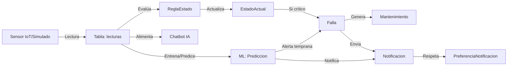

# Diagrama Entidad-Relación (ERD) - MVP

> Diagrama optimizado para MVP del sistema RIM- (Moto Inteligente con Gemelo Digital)
>
> **Versión**: 2.2 MVP
> **Fecha**: 10 de noviembre de 2025
> **Modelo Base**: KTM 390 Duke 2024
> **Enfoque**: Sistema escalable con ML, gemelo digital, y 11 componentes medibles

---

## 🎯 Principios de Diseño MVP

1. **PKs Estandarizadas**: Todas las tablas usan `id` como PK (excepto tablas de unión)
2. **Soft Delete**: Campos `deleted_at` para recuperación de datos
3. **Timestamps**: `created_at` y `updated_at` automáticos
4. **Sensores IoT**: Sistema completo de telemetría en tiempo real
5. **11 Componentes**: Configuración específica para KTM 390 Duke
6. **Freemium**: Sistema de suscripciones con características limitadas

---

## 📊 Diagrama Principal

```mermaid
---
title: RIM- MVP - Sistema de Moto Inteligente KTM 390 Duke
config:
  theme: default
  look: classic
---
erDiagram
    %% ============================================
    %% MÓDULO 1: AUTH & USUARIOS
    %% ============================================
    
    Usuario ||--o{ Moto : "posee"
    Usuario ||--o| Suscripcion : "tiene"
    Usuario ||--o{ Notificacion : "recibe"
    Usuario ||--o{ Conversacion : "inicia"
    Usuario ||--o{ Falla : "reporta"
    Usuario ||--o{ Viaje : "realiza"
    Usuario ||--o{ AlertaPersonalizada : "crea"
    Usuario ||--o{ RefreshToken : "genera"
    Usuario ||--o{ PasswordResetToken : "solicita"
    Usuario ||--o{ EmailVerificationToken : "recibe"
    
    Usuario {
        int id PK
        string email UK "Email único"
        string password_hash "Hash bcrypt"
        string nombre
        string apellido
        string telefono
        boolean email_verificado
        boolean activo
        string rol "user, admin"
        datetime ultimo_login
        datetime created_at
        datetime updated_at
        datetime deleted_at
    }
    
    RefreshToken {
        int id PK
        int usuario_id FK
        text token UK "Token JWT refresh"
        datetime expires_at
        boolean revocado
        datetime revocado_at
        string ip_address
        string user_agent
        datetime created_at
        datetime updated_at
        datetime deleted_at
    }
    
    PasswordResetToken {
        int id PK
        int usuario_id FK
        string token UK
        datetime expires_at
        boolean usado
        datetime usado_at
        datetime created_at
        datetime updated_at
        datetime deleted_at
    }
    
    EmailVerificationToken {
        int id PK
        int usuario_id FK
        string token UK
        datetime expires_at
        boolean usado
        datetime usado_at
        datetime created_at
        datetime updated_at
        datetime deleted_at
    }
    
    %% ============================================
    %% MÓDULO 2: SUSCRIPCIONES (Free/Pro)
    %% ============================================
    
    Suscripcion }o--|| Plan : "basada en"
    Plan ||--o{ PlanCaracteristica : "incluye"
    Caracteristica ||--o{ PlanCaracteristica : "pertenece a"
    
    Plan {
        int id PK
        string nombre_plan UK "free, pro"
        decimal precio "0.00 para free"
        string periodo_facturacion "mensual, anual, unico"
        datetime created_at
        datetime updated_at
    }
    
    Caracteristica {
        int id PK
        string clave_funcion UK "CHAT_LLM, ML_PREDICTIONS, LIVE_MONITORING"
        text descripcion
        datetime created_at
        datetime updated_at
    }
    
    PlanCaracteristica {
        int plan_id PK, FK
        int caracteristica_id PK, FK
    }
    
    Suscripcion {
        int id PK
        int usuario_id FK, UK "Un usuario = una suscripción"
        int plan_id FK
        datetime fecha_inicio
        datetime fecha_fin "NULL para free o vitalicio"
        string estado_suscripcion "activa, cancelada, pendiente_pago"
        datetime created_at
        datetime updated_at
    }
    
    %% ============================================
    %% MÓDULO 3: MOTOS Y COMPONENTES (CORE MVP)
    %% ============================================
    
    ModeloMoto ||--o{ Moto : "modelo de"
    ModeloMoto ||--o{ Componente : "define componentes"
    
    Moto ||--o{ EstadoActual : "estado actual de"
    Moto ||--o{ Mantenimiento : "requiere"
    Moto ||--o{ Falla : "presenta"
    Moto ||--o{ Conversacion : "contexto de"
    Moto ||--o{ Sensor : "equipada con"
    Moto ||--o{ Lectura : "genera telemetría"
    Moto ||--o{ Viaje : "realiza"
    Moto ||--o{ AlertaPersonalizada : "tiene alertas custom"
    
    Componente ||--o{ ReglaEstado : "tiene reglas"
    Componente ||--o{ EstadoActual : "estado calculado"
    Componente ||--o{ Sensor : "monitoreado por"
    Componente ||--o{ AlertaPersonalizada : "alerta personalizada"
    
    Parametro ||--o{ ReglaEstado : "define umbrales"
    Parametro ||--o{ Sensor : "mide"
    Parametro ||--o{ AlertaPersonalizada : "umbral custom"
    
    ModeloMoto {
        int id PK
        string nombre UK "KTM 390 Duke 2024, KTM 790 Duke"
        string marca "KTM, Yamaha, Honda"
        int año "Año del modelo"
        string cilindrada "373cc, 799cc"
        string tipo_motor "monocilíndrico, bicilíndrico"
        jsonb especificaciones_tecnicas
        boolean activo
        datetime created_at
        datetime updated_at
    }
    
    Moto {
        int id PK "Estandarizado a id"
        int usuario_id FK
        int modelo_moto_id FK
        string vin UK "VIN único 17 chars"
        string placa UK
        string color
        decimal kilometraje_actual
        text observaciones
        datetime created_at
        datetime updated_at
    }
    
    Componente {
        int id PK "Estandarizado a id"
        int modelo_moto_id FK
        string nombre "Motor, Batería, Frenos, etc"
        string mesh_id_3d UK "ID para modelo 3D"
        text descripcion
        datetime created_at
        datetime updated_at
    }
    
    AlertaPersonalizada {
        int id PK
        int usuario_id FK
        int moto_id FK
        int componente_id FK
        int parametro_id FK
        string nombre "Mi alerta de temperatura motor"
        decimal umbral_personalizado
        string operador "MAYOR_QUE, MENOR_QUE, IGUAL_A"
        string nivel_severidad "info, warning, critical"
        boolean activa
        datetime created_at
        datetime updated_at
        datetime deleted_at
    }
    
    Parametro {
        int id PK "Estandarizado a id"
        string nombre UK "temperatura, presion, voltaje"
        string unidad_medida "°C, bar, V, mm, L, RPM"
    }
    
    ReglaEstado {
        int id PK "Estandarizado a id"
        int componente_id FK
        int parametro_id FK
        string logica "MAYOR_QUE, MENOR_QUE, ENTRE"
        decimal limite_bueno
        decimal limite_atencion
        decimal limite_critico
        datetime created_at
        datetime updated_at
    }
    
    EstadoActual {
        int id PK "Estandarizado a id"
        int moto_id FK
        int componente_id FK
        decimal ultimo_valor
        string estado "EXCELENTE, BUENO, ATENCION, CRITICO, FRIO"
        datetime ultima_actualizacion
        constraint UK "UNIQUE(moto_id, componente_id)"
    }
    
    %% ============================================
    %% MÓDULO 4: SENSORES IOT (Telemetría en Tiempo Real)
    %% ============================================
    
    SensorTemplate ||--o{ Sensor : "plantilla de"
    Sensor ||--o{ Lectura : "produce"
    Sensor ||--o{ Falla : "detecta"
    
    SensorTemplate {
        uuid id PK "UUID para distribución"
        string modelo "KTM 390 Duke"
        string name "Sensor de temperatura, presión, etc"
        jsonb definition "Configuración del sensor"
        datetime created_at
        datetime updated_at
    }
    
    Sensor {
        uuid id PK "UUID para IoT distribuido"
        int moto_id FK
        uuid template_id FK
        int parametro_id FK "Parámetro que mide"
        int componente_id FK "Componente que monitorea"
        string nombre "Nombre descriptivo"
        string tipo "temperature, pressure, voltage, etc"
        jsonb config "Configuración específica"
        string sensor_state "ok, degraded, faulty, offline, unknown"
        jsonb last_value "Última lectura"
        datetime last_seen
        datetime created_at
        datetime updated_at
    }
    
    Lectura {
        bigint id PK "BigInt para millones de registros"
        int moto_id FK
        uuid sensor_id FK
        int componente_id FK
        int parametro_id FK
        datetime ts "Timestamp de lectura"
        jsonb valor "Valor y metadatos"
        jsonb metadata "Calidad, anomalía, etc"
        datetime created_at
    }
    
    %% ============================================
    %% MÓDULO 5: FALLAS Y MANTENIMIENTO
    %% ============================================
    
    Falla ||--o{ Mantenimiento : "genera"
    
    Falla {
        int id PK
        int moto_id FK
        uuid sensor_id FK "Sensor que detectó (opcional)"
        int componente_id FK "Componente afectado"
        int usuario_id FK "Usuario que reportó (opcional)"
        string codigo UK "FL-20250110-001"
        string tipo "sobrecalentamiento, bateria_baja, etc"
        string titulo
        text descripcion
        string severidad "baja, media, alta, critica"
        string estado "detectada, en_reparacion, resuelta"
        string origen_deteccion "sensor, ml, manual"
        float valor_actual
        float valor_esperado
        boolean requiere_atencion_inmediata
        boolean puede_conducir
        text solucion_sugerida
        datetime fecha_deteccion
        datetime fecha_resolucion
        datetime created_at
        datetime updated_at
        datetime deleted_at
    }
    
    Mantenimiento {
        int id PK
        string codigo UK "MNT-20250110-001"
        int moto_id FK
        int falla_relacionada_id FK "NULL si es preventivo"
        string tipo "preventivo, correctivo, inspeccion"
        string estado "pendiente, en_proceso, completado, cancelado"
        int kilometraje_actual
        int kilometraje_siguiente "Para próximo servicio"
        date fecha_programada
        datetime fecha_completado
        text descripcion
        text notas_tecnico
        float costo_estimado
        float costo_real
        datetime created_at
        datetime updated_at
        datetime deleted_at
    }
    
    %% ============================================
    %% MÓDULO 6: VIAJES (Tracking de Rutas)
    %% ============================================
    
    Viaje {
        int id PK "Nuevo: agregado del SCRIPT.sql"
        int moto_id FK
        int usuario_id FK "Redundante pero útil para queries"
        datetime timestamp_inicio
        datetime timestamp_fin
        decimal distancia_km
        decimal velocidad_media_kmh
        decimal kilometraje_inicio
        decimal kilometraje_fin
        jsonb ruta_gps "Puntos GPS opcionales"
        datetime created_at
    }
    
    %% ============================================
    %% MÓDULO 7: NOTIFICACIONES
    %% ============================================
    
    Usuario ||--o| PreferenciaNotificacion : "configura"
    
    Notificacion {
        int id PK
        int usuario_id FK
        string titulo
        text mensaje
        string tipo "info, warning, alert, success, error"
        string canal "in_app, email, push, sms"
        string estado "pendiente, enviada, leida, fallida"
        string referencia_tipo "falla, mantenimiento, sensor"
        int referencia_id "ID del objeto referenciado"
        boolean leida
        datetime leida_en
        int intentos_envio
        datetime created_at
        datetime updated_at
        datetime deleted_at
    }
    
    PreferenciaNotificacion {
        int id PK
        int usuario_id FK, UK "Un usuario = una preferencia"
        jsonb canales_habilitados '{"in_app": true, "email": false}'
        jsonb tipos_habilitados '{"fallas": true, "marketing": false}'
        string no_molestar_inicio "22:00"
        string no_molestar_fin "08:00"
        jsonb configuracion_adicional
        datetime created_at
        datetime updated_at
    }
    
    %% ============================================
    %% MÓDULO 8: CHATBOT IA
    %% ============================================
    
    Conversacion ||--o{ Mensaje : "contiene"
    
    Conversacion {
        int id PK
        string conversation_id UK "ID único para sesión"
        int usuario_id FK
        int moto_id FK "Contexto de la conversación"
        string titulo
        boolean activa
        int total_mensajes
        datetime ultima_actividad
        datetime created_at
        datetime updated_at
        datetime deleted_at
    }
    
    Mensaje {
        int id PK
        int conversacion_id FK
        string role "user, assistant"
        text contenido
        string tipo_prompt "diagnostic, maintenance, explanation"
        datetime created_at
        datetime updated_at
    }
    
    %% ============================================
    %% MÓDULO 9: MACHINE LEARNING (Predicciones)
    %% ============================================
    
    Prediccion }o--|| Moto : "predice para"
    Prediccion }o--|| Usuario : "notifica a"
    Prediccion }o--o| Falla : "se relaciona con"
    Prediccion }o--o| Mantenimiento : "genera"
    EntrenamientoModelo }o--o| Usuario : "entrenado por"
    
    Prediccion {
        int id PK
        int moto_id FK
        int usuario_id FK
        int componente_id FK "Componente predicho (opcional)"
        string tipo "falla, anomalia, mantenimiento, desgaste"
        text descripcion
        float confianza "0.0 a 1.0"
        string nivel_confianza "muy_bajo, bajo, medio, alto, muy_alto"
        float probabilidad_falla "0.0 a 1.0"
        int tiempo_estimado_dias
        datetime fecha_estimada
        string modelo_usado
        string version_modelo
        jsonb datos_entrada
        jsonb resultados
        jsonb metricas
        string estado "pendiente, confirmada, falsa, expirada"
        boolean validada
        int validada_por FK
        datetime validada_en
        int falla_relacionada_id FK
        int mantenimiento_relacionado_id FK
        boolean notificacion_enviada
        datetime created_at
        datetime updated_at
        datetime deleted_at
    }
    
    EntrenamientoModelo {
        int id PK
        string nombre_modelo
        string version
        string tipo_modelo "clasificacion, regresion, clustering"
        float accuracy
        float precision
        float recall
        float f1_score
        float mse "Mean Squared Error"
        float rmse "Root Mean Squared Error"
        int num_muestras_entrenamiento
        int num_muestras_validacion
        int num_muestras_test
        jsonb hiperparametros
        jsonb features_usadas
        float duracion_entrenamiento_segundos
        datetime fecha_inicio
        datetime fecha_fin
        string ruta_modelo
        string ruta_scaler
        boolean en_produccion
        boolean activo
        int entrenado_por FK
        text notas
        datetime created_at
        datetime updated_at
        datetime deleted_at
    }
```

---

## 📝 Cambios Clave del MVP

### ✅ Mejoras Implementadas

1. **PKs Estandarizadas a `id`**
   - ❌ Antes: `moto_id`, `componente_id`, `parametro_id`, etc.
   - ✅ Ahora: Todas usan `id` (excepto tablas de unión)
   - Excepción: `Sensor` y `SensorTemplate` mantienen UUID para IoT

2. **Normalización de Modelos de Moto**
   - ✅ Nueva tabla `modelos_moto` para gestionar catálogo de modelos
   - Elimina redundancia de string "KTM 390 Duke 2024" repetido
   - Facilita agregar nuevos modelos (KTM 790, 890, 1290, etc.)
   - `Moto` ahora tiene FK a `modelo_moto_id`
   - `Componente` asociado a `modelo_moto_id` (cada modelo tiene sus 11+ componentes)

3. **Alertas Personalizadas por Usuario**
   - ✅ Nueva tabla `alertas_personalizadas`
   - Permite umbrales customizados por usuario (ej: alertar si temp motor > 95°C en lugar de 105°C)
   - Complementa `ReglaEstado` (reglas globales) vs alertas individuales
   - Usuario puede crear alertas para componentes específicos de su moto

4. **Tabla `Viaje` Agregada**
   - ✅ Implementada del SCRIPT.sql original
   - Tracking de rutas, distancia, velocidad
   - Campo `ruta_gps` JSONB para almacenar puntos GPS

5. **Gemelo Digital en Frontend**
   - Frontend simula el comportamiento completo de la moto
   - Backend agnóstico: procesa lecturas sin distinguir origen
   - Permite testing, demos y desarrollo sin hardware real

6. **Sistema de ML Completo**
   - ✅ Tabla `Prediccion` restaurada para alertas predictivas
   - ✅ Tabla `EntrenamientoModelo` para MLOps básico
   - Predicciones de fallas, anomalías, mantenimiento

7. **Preferencias de Notificaciones por Usuario**
   - ✅ Tabla `PreferenciaNotificacion` restaurada
   - Control granular de canales (in-app, email, push, SMS)
   - Horarios "No molestar" configurables

8. **Eliminación de Redundancias**
   - ❌ Eliminado: `HistorialLectura` (redundante con `Lectura`)
   - ❌ Eliminado: Campo `modelo` string en `Moto` → Normalizado a FK `modelo_moto_id`
   - ❌ Eliminado: Campo `modelo` string en `Componente` → Normalizado a FK `modelo_moto_id`

9. **Coherencia con SCRIPT.sql**
   - ✅ Estructura de componentes/parámetros/reglas igual
   - ✅ Estados de salud compatibles (incluyendo FRIO)
   - ✅ Sistema de viajes integrado

---

## 🎯 Los 11 Componentes Medibles: KTM 390 Duke 2024

### Configuración en Base de Datos

Todos los componentes se almacenan en la tabla `Componente` vinculados a `modelo_moto_id`.

**Ejemplo: KTM 390 Duke 2024 (11 componentes)**

| ID | modelo_moto_id | Nombre | mesh_id_3d | Parámetros |
|----|----------------|--------|------------|------------|
| 1 | 1 | Motor (Servicio/Aceite) | engine_service | km_desde_servicio, meses_desde_servicio |
| 2 | 1 | Depósito de Combustible | fuel_tank | litros_combustible |
| 3 | 1 | Neumático Delantero | front_tire | presion_bar |
| 4 | 1 | Neumático Trasero | rear_tire | presion_bar |
| 5 | 1 | Sistema Eléctrico | electrical_system | voltaje |
| 6 | 1 | Motor (Temperatura) | engine_temp | temperatura_celsius |
| 7 | 1 | Motor (RPM Ralentí) | engine_rpm | rpm |
| 8 | 1 | Freno Delantero (Disco) | front_brake_disc | espesor_mm |
| 9 | 1 | Freno Delantero (Pastillas) | front_brake_pads | espesor_mm |
| 10 | 1 | Cadena de Transmisión | chain | holgura_mm |
| 11 | 1 | Rueda Trasera (Gomas) | rear_wheel_rubber | holgura_mm |

**Nota**: `modelo_moto_id = 1` corresponde a "KTM 390 Duke 2024" en la tabla `modelos_moto`.

### Estados de Salud

- 🟢 **EXCELENTE** - Condición óptima
- 🔵 **BUENO** - Dentro de especificaciones normales
- 🟠 **ATENCION** - Requiere revisión pronto
- 🔴 **CRITICO** - Acción inmediata requerida
- 🟦 **FRIO** - Solo para temperatura motor (<35°C)

---

## 🔑 Cambios de Primary Keys

### Antes (Inconsistente)

```sql
-- Diferentes nombres de PK
motos.moto_id
componentes.componente_id
parametros.parametro_id
reglas_estado.regla_id
historial_lecturas.lectura_id
estado_actual.estado_actual_id
```

### Ahora (Estandarizado)

```sql
-- Todas usan 'id' como PK
motos.id
componentes.id
parametros.id
reglas_estado.id
lecturas.id
estado_actual.id
```

### Excepciones Justificadas

```sql
-- UUID para IoT distribuido
sensor_templates.id (UUID)
sensores.id (UUID)

-- Tablas de unión con PK compuesta
plan_caracteristicas (plan_id, caracteristica_id)
```

---

## �️ Gemelo Digital: KTM 390 Duke 2024

### Concepto MVP

El sistema funciona como un **gemelo digital** de la KTM 390 Duke 2024:

- **Frontend**: Simula el comportamiento completo de la moto (arranque, aceleración, frenado, etc.)
- **Backend**: Procesa telemetría sin distinguir si viene de sensores reales o del gemelo digital
- **Modelo Base**: KTM 390 Duke 2024 con 11 componentes medibles

### Arquitectura de Datos

```
Frontend (Gemelo Digital)
    ↓ WebSocket/HTTP
Backend (Agnóstico)
    ↓
Base de Datos
```

**Ventajas**:

- ✅ Backend simple: no sabe si los datos son reales o simulados
- ✅ Sensores reales e interpolables cuando estén disponibles
- ✅ Testing y demos sin hardware físico
- ✅ Desarrollo paralelo frontend/backend

### Expansión Futura

**Fase 1 (MVP)**: KTM 390 Duke 2024

- 11 componentes medibles configurados
- Gemelo digital completo en frontend
- Sistema de telemetría funcional

**Fase 2**: Otros modelos KTM

- KTM 790 Duke
- KTM 890 Duke R
- KTM 1290 Super Duke R
- Cada modelo con sus propios componentes y parámetros

**Implementación**:

```sql
-- Tabla componentes ya soporta múltiples modelos
ALTER TABLE componentes 
ADD COLUMN modelo VARCHAR(100);  -- 'KTM 390 Duke 2024', 'KTM 790 Duke', etc.

-- Filtrar por modelo
SELECT * FROM componentes WHERE modelo = 'KTM 390 Duke 2024';
```

---

## 📊 Resumen de Tablas MVP

### Core (13 tablas)

1. ✅ `usuarios` - Auth y perfil
2. ✅ `refresh_tokens` - JWT refresh
3. ✅ `password_reset_tokens` - Reset contraseña
4. ✅ `email_verification_tokens` - Verificación email
5. ✅ `planes` - Planes free/pro
6. ✅ `caracteristicas` - Features por plan
7. ✅ `plan_caracteristicas` - Unión M:N
8. ✅ `suscripciones` - Suscripción de usuario
9. ✅ `modelos_moto` - Catálogo de modelos (KTM 390, 790, etc.) **[NUEVO]**
10. ✅ `motos` - Vehículos del usuario
11. ✅ `componentes` - Componentes por modelo
12. ✅ `parametros` - Métricas a medir
13. ✅ `reglas_estado` - Umbrales por componente

### Features (14 tablas)

1. ✅ `estado_actual` - Estado en tiempo real
2. ✅ `sensor_templates` - Plantillas IoT
3. ✅ `sensores` - Instancias de sensores
4. ✅ `lecturas` - Telemetría (reemplaza historial_lecturas)
5. ✅ `fallas` - Detección de problemas
6. ✅ `mantenimientos` - Servicios y reparaciones
7. ✅ `viajes` - Tracking de rutas
8. ✅ `alertas_personalizadas` - Umbrales custom por usuario **[NUEVO]**
9. ✅ `notificaciones` - Alertas multi-canal
10. ✅ `preferencias_notificaciones` - Config por usuario
11. ✅ `conversaciones` - Chatbot IA
12. ✅ `mensajes` - Historial de chat
13. ✅ `predicciones` - Predicciones ML
14. ✅ `entrenamientos_modelos` - MLOps básico

**Total: 27 tablas** (+2 nuevas: `modelos_moto`, `alertas_personalizadas`)

---

## 🚫 Tablas Eliminadas vs Restauradas

| Tabla | Estado | Razón |
|-------|--------|-------|
| `HistorialLectura` | ❌ Eliminado | Redundante con `Lectura` |
| `Prediccion` | ✅ Restaurado | Necesario para ML y alertas predictivas |
| `EntrenamientoModelo` | ✅ Restaurado | MLOps básico para tracking de modelos |
| `PreferenciaNotificacion` | ✅ Restaurado | Control granular por usuario, no config global |

---

## 🔄 Flujo de Datos Principal



---

## ✅ Ventajas del Nuevo Diseño MVP

1. ✅ **Consistencia**: Todas las PKs usan `id`
2. ✅ **Normalización**: Tabla `modelos_moto` evita redundancia de strings
3. ✅ **Personalización**: `alertas_personalizadas` permite umbrales custom por usuario
4. ✅ **ML Completo**: Sistema de predicciones y tracking de modelos
5. ✅ **Gemelo Digital**: Frontend simula comportamiento de la moto
6. ✅ **Preferencias**: Control granular de notificaciones por usuario
7. ✅ **Completo**: Incluye tabla `viajes` del SCRIPT.sql
8. ✅ **IoT Ready**: Sistema de sensores robusto y agnóstico
9. ✅ **Escalable**: Base para múltiples modelos KTM (390, 790, 890, 1290)
10. ✅ **Freemium**: Sistema de suscripciones funcional
11. ✅ **Coherente**: Integra lo mejor de ambos diseños

---

## ⚠️ Consideraciones Importantes

### 🚨 Posible Colisión en Campos `codigo`

Las tablas `Falla` y `Mantenimiento` utilizan campos `codigo` con formato similar:

```sql
-- Falla.codigo = "FL-20250110-001"
-- Mantenimiento.codigo = "MNT-20250110-001"
```

**Problema**: Si se usa un generador de códigos genérico, podría haber colisión si no se diferencia el prefijo.

**Soluciones**:

1. ✅ **Prefijos distintos** (implementado): `FL-` vs `MNT-`
2. ✅ **Constraint UNIQUE** en cada tabla para el campo `codigo`
3. ⚠️ **Considerar**: Agregar validación a nivel de aplicación para asegurar prefijos correctos
4. 📋 **Alternativa futura**: Usar un generador UUID o secuencia global única

**Recomendación MVP**: Mantener prefijos distintos y agregar constraint UNIQUE + validación en el servicio.

---

## 🚀 Próximos Pasos

1. **Crear tabla `modelos_moto`** y migrar datos existentes
2. **Actualizar modelos Python**:
   - `Moto`: Agregar FK `modelo_moto_id`, eliminar campo `modelo` string
   - `Componente`: Agregar FK `modelo_moto_id`, eliminar campo `modelo` string
   - Crear modelo `ModeloMoto`
   - Crear modelo `AlertaPersonalizada`
3. **Crear migración Alembic**:
   - Renombrar PKs (moto_id → id, etc.)
   - Crear tabla `modelos_moto`
   - Crear tabla `alertas_personalizadas`
   - Migrar datos: insertar "KTM 390 Duke 2024" y actualizar FKs
4. **Ejecutar seed** de 11 componentes con `modelo_moto_id = 1`
5. **Implementar validación de códigos** en servicios de Falla y Mantenimiento
6. **Implementar gemelo digital** en frontend:
   - Simulador de arranque/aceleración/frenado
   - Generación de telemetría realista
   - Inyección de escenarios (sobrecalentamiento, batería baja, etc.)
7. **Crear endpoints** para:
   - CRUD de alertas personalizadas
   - Gestionar preferencias de notificaciones
   - Consultar predicciones ML
   - Tracking de viajes
8. **Tests unitarios** para validar cambios
9. **Documentar** API de telemetría y WebSocket

---

**Última actualización**: 10 de noviembre de 2025  
**Versión**: 2.2 MVP (con Normalización de Modelos y Alertas Personalizadas)  
