# 🔄 Flujos del Sistema RIM- MVP v2.3

> Documentación completa de flujos de usuario y procesos del sistema
>
> **Versión**: 2.3 MVP
> **Fecha**: 10 de noviembre de 2025
> **Modelo Base**: KTM 390 Duke 2024
> **Nuevo en v2.3**: Sistema de límites Freemium con acceso medido a features premium

---

## 📑 Índice de Flujos

### Flujos de Usuario

1. [Registro e Inicio de Sesión](#1-registro-e-inicio-de-sesión)
2. [Onboarding y Registro de Moto](#2-onboarding-y-registro-de-moto)
3. [Monitoreo en Tiempo Real](#3-monitoreo-en-tiempo-real)
4. [Detección y Gestión de Fallas](#4-detección-y-gestión-de-fallas)
5. [Mantenimiento Preventivo y Correctivo](#5-mantenimiento-preventivo-y-correctivo)
6. [Chatbot IA - Consultas](#6-chatbot-ia---consultas)
7. [Análisis ML Completo de la Moto](#7-análisis-ml-completo-de-la-moto)
8. [Gestión de Viajes](#8-gestión-de-viajes)
9. [Upgrade Free → Pro](#9-upgrade-free--pro)
10. [Alertas Personalizadas (Pro)](#10-alertas-personalizadas-pro)
11. [Sistema de Límites Freemium (v2.3)](#11-sistema-de-límites-freemium-v23)

### Flujos Técnicos

12. [Procesamiento de Telemetría](#12-procesamiento-de-telemetría)
13. [Evaluación de Reglas de Estado](#13-evaluación-de-reglas-de-estado)
14. [Sistema de Notificaciones](#14-sistema-de-notificaciones)
15. [Entrenamiento de Modelos ML](#15-entrenamiento-de-modelos-ml)

---

## 1. Registro e Inicio de Sesión

### Flujo: Registro de Nuevo Usuario

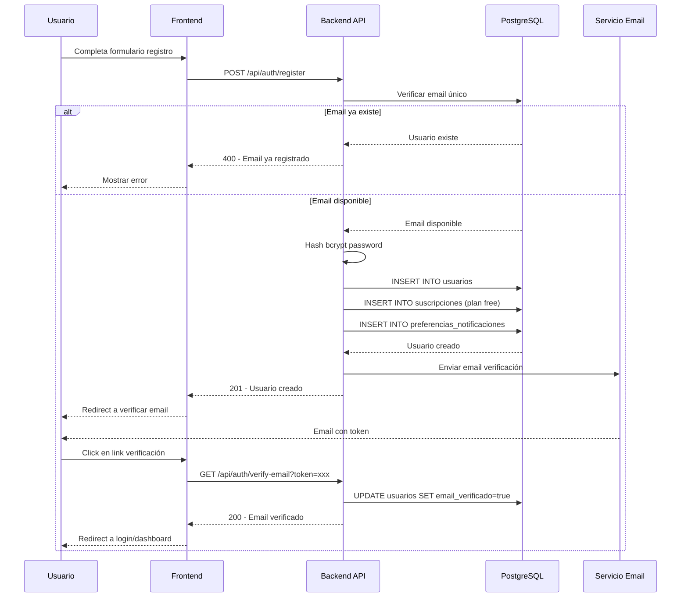
```mermaid
sequenceDiagram
    participant U as Usuario
    participant F as Frontend
    participant API as Backend API
    participant DB as PostgreSQL
    participant Email as Servicio Email

    U->>F: Completa formulario registro
    F->>API: POST /api/auth/register
    
    API->>DB: Verificar email único
    alt Email ya existe
        DB-->>API: Usuario existe
        API-->>F: 400 - Email ya registrado
        F-->>U: Mostrar error
    else Email disponible
        DB-->>API: Email disponible
        API->>API: Hash bcrypt password
        API->>DB: INSERT INTO usuarios
        API->>DB: INSERT INTO suscripciones (plan free)
        API->>DB: INSERT INTO preferencias_notificaciones
        DB-->>API: Usuario creado
        
        API->>Email: Enviar email verificación
        API-->>F: 201 - Usuario creado
        F-->>U: Redirect a verificar email
        
        Email-->>U: Email con token
        U->>F: Click en link verificación
        F->>API: GET /api/auth/verify-email?token=xxx
        API->>DB: UPDATE usuarios SET email_verificado=true
        API-->>F: 200 - Email verificado
        F-->>U: Redirect a login/dashboard
    end
```

**Endpoints:**

```python
POST   /api/auth/register
POST   /api/auth/login
GET    /api/auth/verify-email?token={token}
POST   /api/auth/resend-verification
```

**Reglas de Negocio:**

- ✅ Email único obligatorio
- ✅ Password mínimo 8 caracteres (1 mayúscula, 1 número, 1 especial)
- ✅ Plan Free asignado automáticamente
- ✅ Email verificación expira en 24 horas
- ✅ Preferencias notificación default creadas

---

### Flujo: Inicio de Sesión

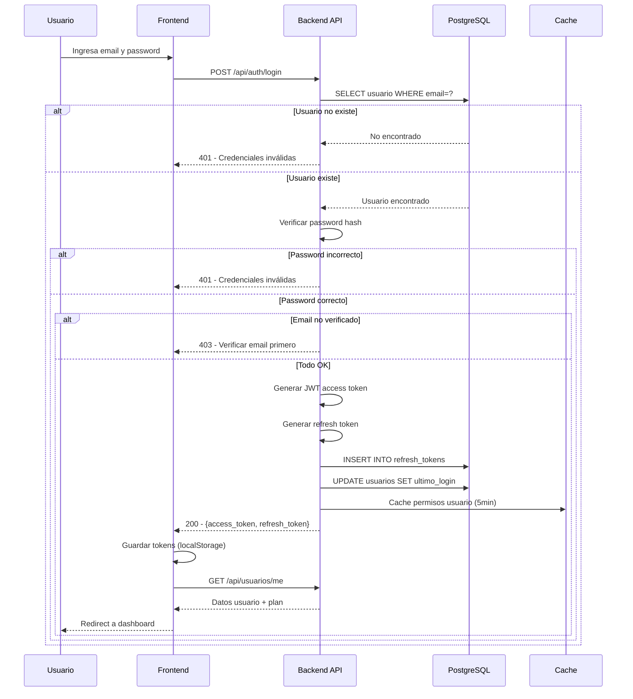
```mermaid
sequenceDiagram
    participant U as Usuario
    participant F as Frontend
    participant API as Backend API
    participant DB as PostgreSQL
    participant Redis as Cache

    U->>F: Ingresa email y password
    F->>API: POST /api/auth/login
    
    API->>DB: SELECT usuario WHERE email=?
    alt Usuario no existe
        DB-->>API: No encontrado
        API-->>F: 401 - Credenciales inválidas
    else Usuario existe
        DB-->>API: Usuario encontrado
        API->>API: Verificar password hash
        
        alt Password incorrecto
            API-->>F: 401 - Credenciales inválidas
        else Password correcto
            alt Email no verificado
                API-->>F: 403 - Verificar email primero
            else Todo OK
                API->>API: Generar JWT access token
                API->>API: Generar refresh token
                API->>DB: INSERT INTO refresh_tokens
                API->>DB: UPDATE usuarios SET ultimo_login
                API->>Redis: Cache permisos usuario (5min)
                
                API-->>F: 200 - {access_token, refresh_token}
                F->>F: Guardar tokens (localStorage)
                F->>API: GET /api/usuarios/me
                API-->>F: Datos usuario + plan
                F-->>U: Redirect a dashboard
            end
        end
    end
```

**Tokens:**

- **Access Token**: JWT válido por 15 minutos
- **Refresh Token**: Válido por 7 días, almacenado en DB

---

## 2. Onboarding y Registro de Moto

### Flujo: Primera Moto del Usuario

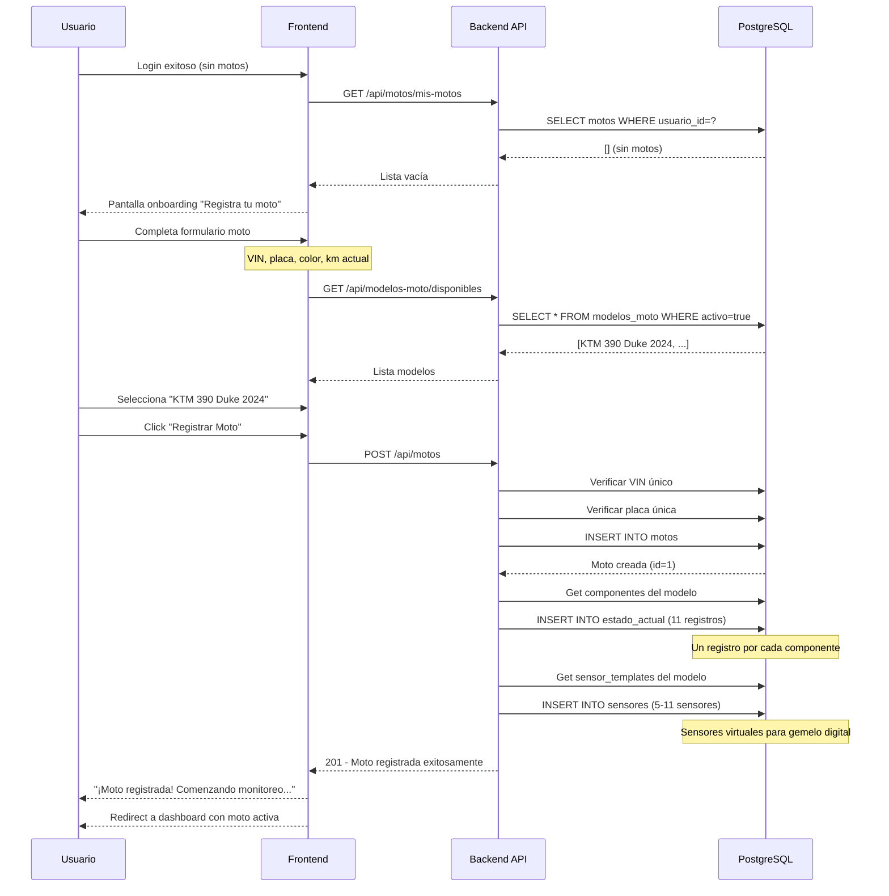
```mermaid
sequenceDiagram
    participant U as Usuario
    participant F as Frontend
    participant API as Backend API
    participant DB as PostgreSQL

    U->>F: Login exitoso (sin motos)
    F->>API: GET /api/motos/mis-motos
    API->>DB: SELECT motos WHERE usuario_id=?
    DB-->>API: [] (sin motos)
    API-->>F: Lista vacía
    
    F-->>U: Pantalla onboarding "Registra tu moto"
    
    U->>F: Completa formulario moto
    Note over F: VIN, placa, color, km actual
    
    F->>API: GET /api/modelos-moto/disponibles
    API->>DB: SELECT * FROM modelos_moto WHERE activo=true
    DB-->>API: [KTM 390 Duke 2024, ...]
    API-->>F: Lista modelos
    
    U->>F: Selecciona "KTM 390 Duke 2024"
    U->>F: Click "Registrar Moto"
    
    F->>API: POST /api/motos
    API->>DB: Verificar VIN único
    API->>DB: Verificar placa única
    API->>DB: INSERT INTO motos
    DB-->>API: Moto creada (id=1)
    
    API->>DB: Get componentes del modelo
    API->>DB: INSERT INTO estado_actual (11 registros)
    Note over DB: Un registro por cada componente
    
    API->>DB: Get sensor_templates del modelo
    API->>DB: INSERT INTO sensores (5-11 sensores)
    Note over DB: Sensores virtuales para gemelo digital
    
    API-->>F: 201 - Moto registrada exitosamente
    F-->>U: "¡Moto registrada! Comenzando monitoreo..."
    F-->>U: Redirect a dashboard con moto activa
```

**Datos Iniciales Creados:**

- ✅ 1 registro en `motos`
- ✅ 11 registros en `estado_actual` (todos en estado BUENO inicial)
- ✅ 5-11 registros en `sensores` (según el modelo)
- ✅ 0 registros en `lecturas` (se crean cuando llegan datos)

---

## 3. Monitoreo en Tiempo Real

### Flujo: Gemelo Digital - Telemetría Simulada

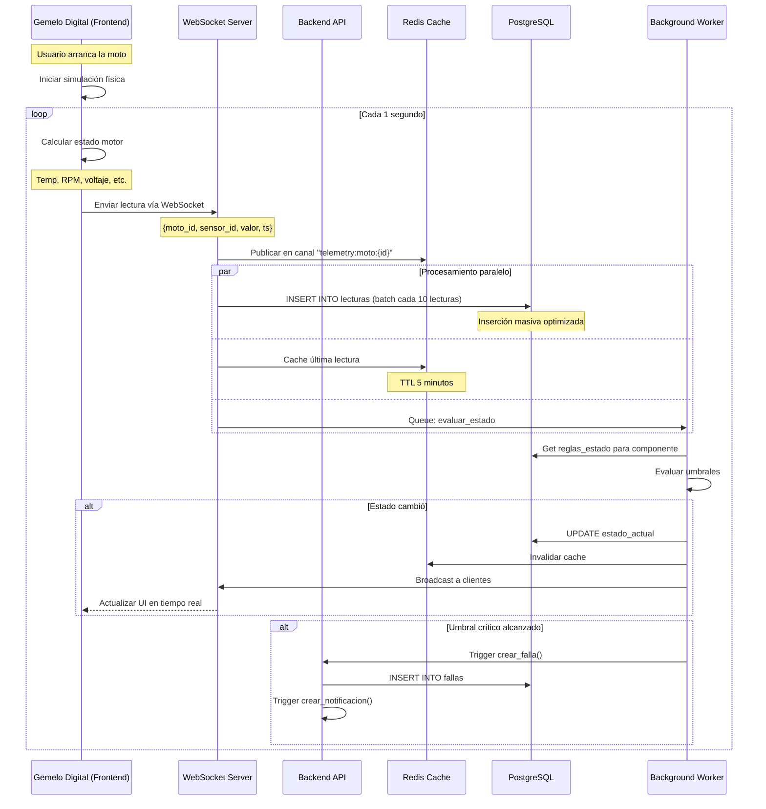
```mermaid
sequenceDiagram
    participant GD as Gemelo Digital (Frontend)
    participant WS as WebSocket Server
    participant API as Backend API
    participant Redis as Redis Cache
    participant DB as PostgreSQL
    participant Worker as Background Worker

    Note over GD: Usuario arranca la moto
    GD->>GD: Iniciar simulación física
    loop Cada 1 segundo
        GD->>GD: Calcular estado motor
        Note over GD: Temp, RPM, voltaje, etc.
        
        GD->>WS: Enviar lectura vía WebSocket
        Note over WS: {moto_id, sensor_id, valor, ts}
        
        WS->>Redis: Publicar en canal "telemetry:moto:{id}"
        
        par Procesamiento paralelo
            WS->>DB: INSERT INTO lecturas (batch cada 10 lecturas)
            Note over DB: Inserción masiva optimizada
        and
            WS->>Redis: Cache última lectura
            Note over Redis: TTL 5 minutos
        and
            WS->>Worker: Queue: evaluar_estado
        end
        
        Worker->>DB: Get reglas_estado para componente
        Worker->>Worker: Evaluar umbrales
        
        alt Estado cambió
            Worker->>DB: UPDATE estado_actual
            Worker->>Redis: Invalidar cache
            Worker->>WS: Broadcast a clientes
            WS-->>GD: Actualizar UI en tiempo real
        end
        
        alt Umbral crítico alcanzado
            Worker->>API: Trigger crear_falla()
            API->>DB: INSERT INTO fallas
            API->>API: Trigger crear_notificacion()
        end
    end
```

**Frecuencias de Lectura:**

- 🟢 Temperatura motor: 1 seg
- 🟡 Voltaje batería: 2 seg
- 🔵 RPM: 500ms
- 🟠 Presión neumáticos: 5 seg
- 🟣 Nivel combustible: 10 seg

---

### Flujo: Dashboard en Tiempo Real

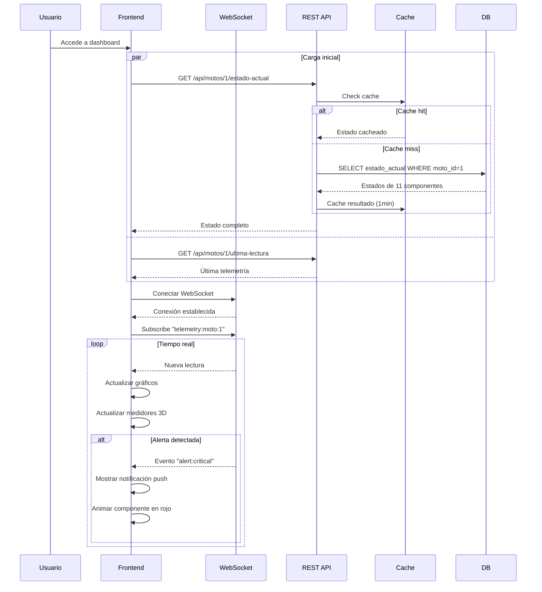
```mermaid
sequenceDiagram
    participant U as Usuario
    participant F as Frontend
    participant WS as WebSocket
    participant API as REST API
    participant Redis as Cache

    U->>F: Accede a dashboard
    
    par Carga inicial
        F->>API: GET /api/motos/1/estado-actual
        API->>Redis: Check cache
        alt Cache hit
            Redis-->>API: Estado cacheado
        else Cache miss
            API->>DB: SELECT estado_actual WHERE moto_id=1
            DB-->>API: Estados de 11 componentes
            API->>Redis: Cache resultado (1min)
        end
        API-->>F: Estado completo
    and
        F->>API: GET /api/motos/1/ultima-lectura
        API-->>F: Última telemetría
    end
    
    F->>WS: Conectar WebSocket
    WS-->>F: Conexión establecida
    
    F->>WS: Subscribe "telemetry:moto:1"
    
    loop Tiempo real
        WS-->>F: Nueva lectura
        F->>F: Actualizar gráficos
        F->>F: Actualizar medidores 3D
        
        alt Alerta detectada
            WS-->>F: Evento "alert:critical"
            F->>F: Mostrar notificación push
            F->>F: Animar componente en rojo
        end
    end
```

---

## 4. Detección y Gestión de Fallas

### Flujo: Detección Automática de Falla

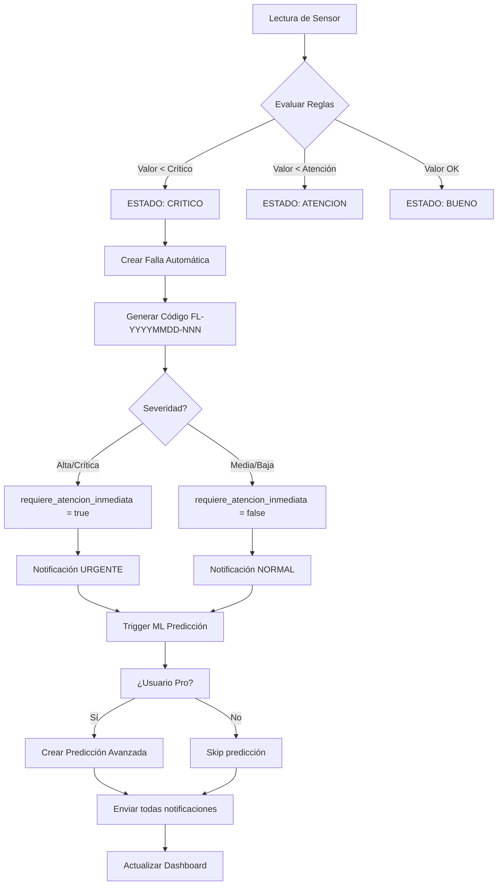
```mermaid
flowchart TD
    A[Lectura de Sensor] --> B{Evaluar Reglas}
    B -->|Valor < Crítico| C[ESTADO: CRITICO]
    B -->|Valor < Atención| D[ESTADO: ATENCION]
    B -->|Valor OK| E[ESTADO: BUENO]
    
    C --> F[Crear Falla Automática]
    F --> G[Generar Código FL-YYYYMMDD-NNN]
    G --> H{Severidad?}
    
    H -->|Alta/Crítica| I[requiere_atencion_inmediata = true]
    H -->|Media/Baja| J[requiere_atencion_inmediata = false]
    
    I --> K[Notificación URGENTE]
    J --> L[Notificación NORMAL]
    
    K --> M[Trigger ML Predicción]
    L --> M
    
    M --> N[¿Usuario Pro?]
    N -->|Sí| O[Crear Predicción Avanzada]
    N -->|No| P[Skip predicción]
    
    O --> Q[Enviar todas notificaciones]
    P --> Q
    
    Q --> R[Actualizar Dashboard]
```

**Ejemplo Concreto: Sobrecalentamiento**

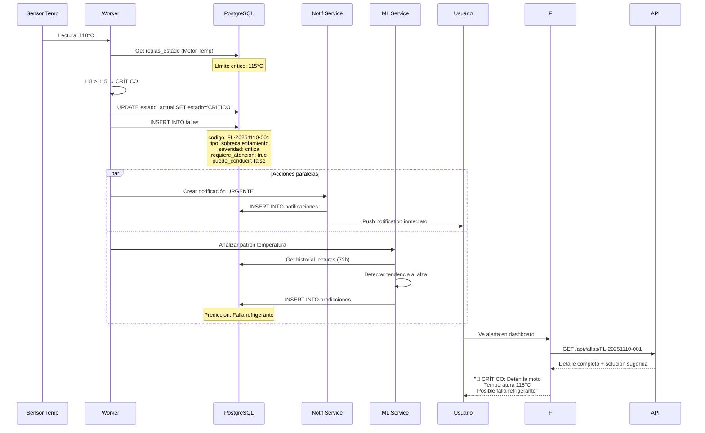
```mermaid
sequenceDiagram
    participant S as Sensor Temp
    participant W as Worker
    participant DB as PostgreSQL
    participant N as Notif Service
    participant ML as ML Service
    participant U as Usuario

    S->>W: Lectura: 118°C
    W->>DB: Get reglas_estado (Motor Temp)
    Note over DB: Límite crítico: 115°C
    
    W->>W: 118 > 115 → CRÍTICO
    W->>DB: UPDATE estado_actual SET estado='CRITICO'
    
    W->>DB: INSERT INTO fallas
    Note over DB: codigo: FL-20251110-001<br/>tipo: sobrecalentamiento<br/>severidad: critica<br/>requiere_atencion: true<br/>puede_conducir: false
    
    par Acciones paralelas
        W->>N: Crear notificación URGENTE
        N->>DB: INSERT INTO notificaciones
        N->>U: Push notification inmediato
    and
        W->>ML: Analizar patrón temperatura
        ML->>DB: Get historial lecturas (72h)
        ML->>ML: Detectar tendencia al alza
        ML->>DB: INSERT INTO predicciones
        Note over DB: Predicción: Falla refrigerante
    end
    
    U->>F: Ve alerta en dashboard
    F->>API: GET /api/fallas/FL-20251110-001
    API-->>F: Detalle completo + solución sugerida
    F-->>U: "🔴 CRÍTICO: Detén la moto<br/>Temperatura 118°C<br/>Posible falla refrigerante"
```

---

### Flujo: Reporte Manual de Falla

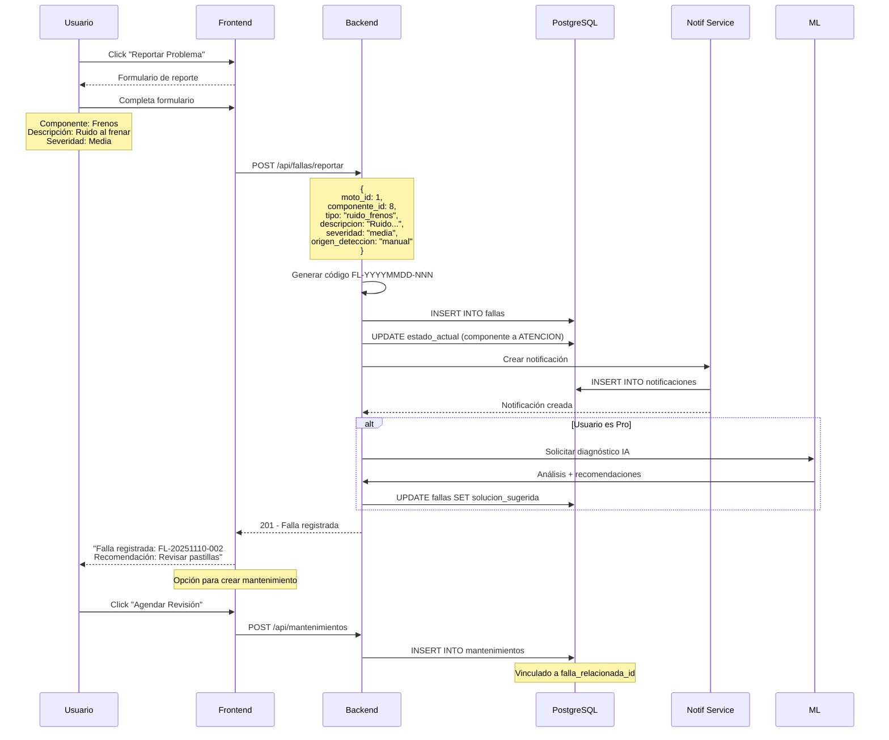
```mermaid
sequenceDiagram
    participant U as Usuario
    participant F as Frontend
    participant API as Backend
    participant DB as PostgreSQL
    participant N as Notif Service

    U->>F: Click "Reportar Problema"
    F-->>U: Formulario de reporte
    
    U->>F: Completa formulario
    Note over U: Componente: Frenos<br/>Descripción: Ruido al frenar<br/>Severidad: Media
    
    F->>API: POST /api/fallas/reportar
    Note over API: {<br/>  moto_id: 1,<br/>  componente_id: 8,<br/>  tipo: "ruido_frenos",<br/>  descripcion: "Ruido...",<br/>  severidad: "media",<br/>  origen_deteccion: "manual"<br/>}
    
    API->>API: Generar código FL-YYYYMMDD-NNN
    API->>DB: INSERT INTO fallas
    API->>DB: UPDATE estado_actual (componente a ATENCION)
    
    API->>N: Crear notificación
    N->>DB: INSERT INTO notificaciones
    N-->>API: Notificación creada
    
    alt Usuario es Pro
        API->>ML: Solicitar diagnóstico IA
        ML->>API: Análisis + recomendaciones
        API->>DB: UPDATE fallas SET solucion_sugerida
    end
    
    API-->>F: 201 - Falla registrada
    F-->>U: "Falla registrada: FL-20251110-002<br/>Recomendación: Revisar pastillas"
    
    Note over F: Opción para crear mantenimiento
    U->>F: Click "Agendar Revisión"
    F->>API: POST /api/mantenimientos
    API->>DB: INSERT INTO mantenimientos
    Note over DB: Vinculado a falla_relacionada_id
```

---

## 5. Mantenimiento Preventivo y Correctivo

### Flujo: Mantenimiento Preventivo

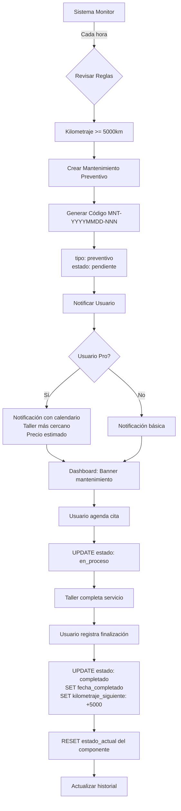
```mermaid
flowchart TD
    A[Sistema Monitor] -->|Cada hora| B{Revisar Reglas}
    B --> C[Kilometraje >= 5000km]
    C --> D[Crear Mantenimiento Preventivo]
    
    D --> E[Generar Código MNT-YYYYMMDD-NNN]
    E --> F[tipo: preventivo<br/>estado: pendiente]
    F --> G[Notificar Usuario]
    
    G --> H{Usuario Pro?}
    H -->|Sí| I[Notificación con calendario<br/>Taller más cercano<br/>Precio estimado]
    H -->|No| J[Notificación básica]
    
    I --> K[Dashboard: Banner mantenimiento]
    J --> K
    
    K --> L[Usuario agenda cita]
    L --> M[UPDATE estado: en_proceso]
    
    M --> N[Taller completa servicio]
    N --> O[Usuario registra finalización]
    O --> P[UPDATE estado: completado<br/>SET fecha_completado<br/>SET kilometraje_siguiente: +5000]
    
    P --> Q[RESET estado_actual del componente]
    Q --> R[Actualizar historial]
```

---

### Flujo: Mantenimiento Correctivo (por Falla)

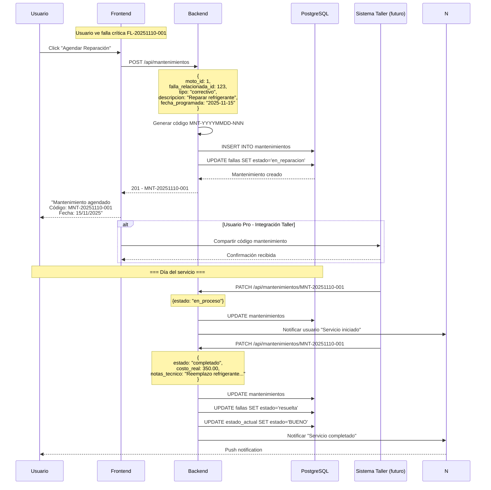
```mermaid
sequenceDiagram
    participant U as Usuario
    participant F as Frontend
    participant API as Backend
    participant DB as PostgreSQL
    participant Taller as Sistema Taller (futuro)

    Note over F: Usuario ve falla crítica FL-20251110-001
    U->>F: Click "Agendar Reparación"
    
    F->>API: POST /api/mantenimientos
    Note over API: {<br/>  moto_id: 1,<br/>  falla_relacionada_id: 123,<br/>  tipo: "correctivo",<br/>  descripcion: "Reparar refrigerante",<br/>  fecha_programada: "2025-11-15"<br/>}
    
    API->>API: Generar código MNT-YYYYMMDD-NNN
    API->>DB: INSERT INTO mantenimientos
    API->>DB: UPDATE fallas SET estado='en_reparacion'
    
    DB-->>API: Mantenimiento creado
    API-->>F: 201 - MNT-20251110-001
    
    F-->>U: "Mantenimiento agendado<br/>Código: MNT-20251110-001<br/>Fecha: 15/11/2025"
    
    alt Usuario Pro - Integración Taller
        F->>Taller: Compartir código mantenimiento
        Taller-->>F: Confirmación recibida
    end
    
    Note over U,DB: === Día del servicio ===
    
    Taller->>API: PATCH /api/mantenimientos/MNT-20251110-001
    Note over API: {estado: "en_proceso"}
    API->>DB: UPDATE mantenimientos
    API->>N: Notificar usuario "Servicio iniciado"
    
    Taller->>API: PATCH /api/mantenimientos/MNT-20251110-001
    Note over API: {<br/>  estado: "completado",<br/>  costo_real: 350.00,<br/>  notas_tecnico: "Reemplazo refrigerante..."<br/>}
    
    API->>DB: UPDATE mantenimientos
    API->>DB: UPDATE fallas SET estado='resuelta'
    API->>DB: UPDATE estado_actual SET estado='BUENO'
    
    API->>N: Notificar "Servicio completado"
    N-->>U: Push notification
```

---

## 6. Chatbot IA - Consultas

### Flujo: Chatbot Básico (Free - Límite: 5 conversaciones/mes)

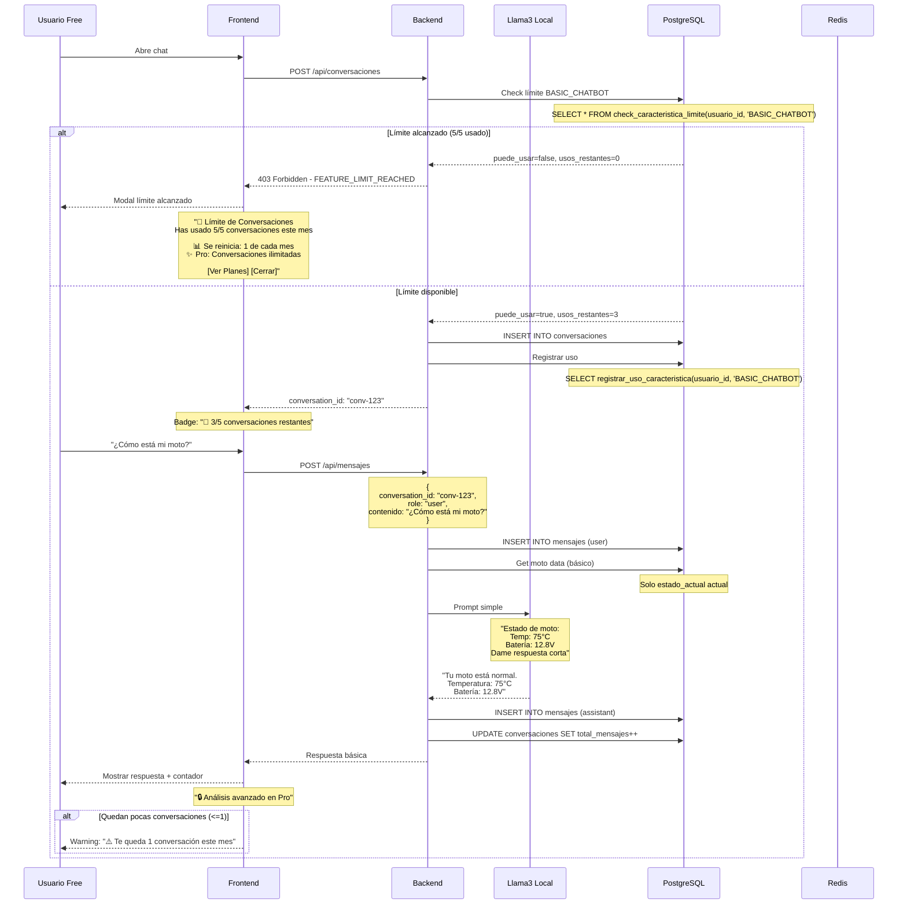
```mermaid
sequenceDiagram
    participant U as Usuario Free
    participant F as Frontend
    participant API as Backend
    participant LLM as Llama3 Local
    participant DB as PostgreSQL
    participant Cache as Redis

    U->>F: Abre chat
    F->>API: POST /api/conversaciones
    
    API->>DB: Check límite BASIC_CHATBOT
    Note over DB: SELECT * FROM check_caracteristica_limite(usuario_id, 'BASIC_CHATBOT')
    
    alt Límite alcanzado (5/5 usado)
        DB-->>API: puede_usar=false, usos_restantes=0
        API-->>F: 403 Forbidden - FEATURE_LIMIT_REACHED
        F-->>U: Modal límite alcanzado
        Note over F: "🚫 Límite de Conversaciones<br/>Has usado 5/5 conversaciones este mes<br/><br/>📊 Se reinicia: 1 de cada mes<br/>✨ Pro: Conversaciones ilimitadas<br/><br/>[Ver Planes] [Cerrar]"
    else Límite disponible
        DB-->>API: puede_usar=true, usos_restantes=3
        API->>DB: INSERT INTO conversaciones
        API->>DB: Registrar uso
        Note over DB: SELECT registrar_uso_caracteristica(usuario_id, 'BASIC_CHATBOT')
        
        API-->>F: conversation_id: "conv-123"
        Note over F: Badge: "💬 3/5 conversaciones restantes"
        
        U->>F: "¿Cómo está mi moto?"
        F->>API: POST /api/mensajes
        Note over API: {<br/>  conversation_id: "conv-123",<br/>  role: "user",<br/>  contenido: "¿Cómo está mi moto?"<br/>}
        
        API->>DB: INSERT INTO mensajes (user)
        
        API->>DB: Get moto data (básico)
        Note over DB: Solo estado_actual actual
        
        API->>LLM: Prompt simple
        Note over LLM: "Estado de moto:<br/>Temp: 75°C<br/>Batería: 12.8V<br/>Dame respuesta corta"
        
        LLM-->>API: "Tu moto está normal.<br/>Temperatura: 75°C<br/>Batería: 12.8V"
        
        API->>DB: INSERT INTO mensajes (assistant)
        API->>DB: UPDATE conversaciones SET total_mensajes++
        
        API-->>F: Respuesta básica
        F-->>U: Mostrar respuesta + contador
        Note over F: "🔒 Análisis avanzado en Pro"
        
        alt Quedan pocas conversaciones (<=1)
            F-->>U: Warning: "⚠️ Te queda 1 conversación este mes"
        end
    end
```

**Límites Plan Free:**

- ✅ **5 conversaciones por mes**
- ✅ Reinicio automático el día 1 de cada mes
- ✅ Contexto básico (solo estado actual)
- ✅ Respuestas cortas

---

### Flujo: Chatbot Avanzado (Pro - Sin Límites)

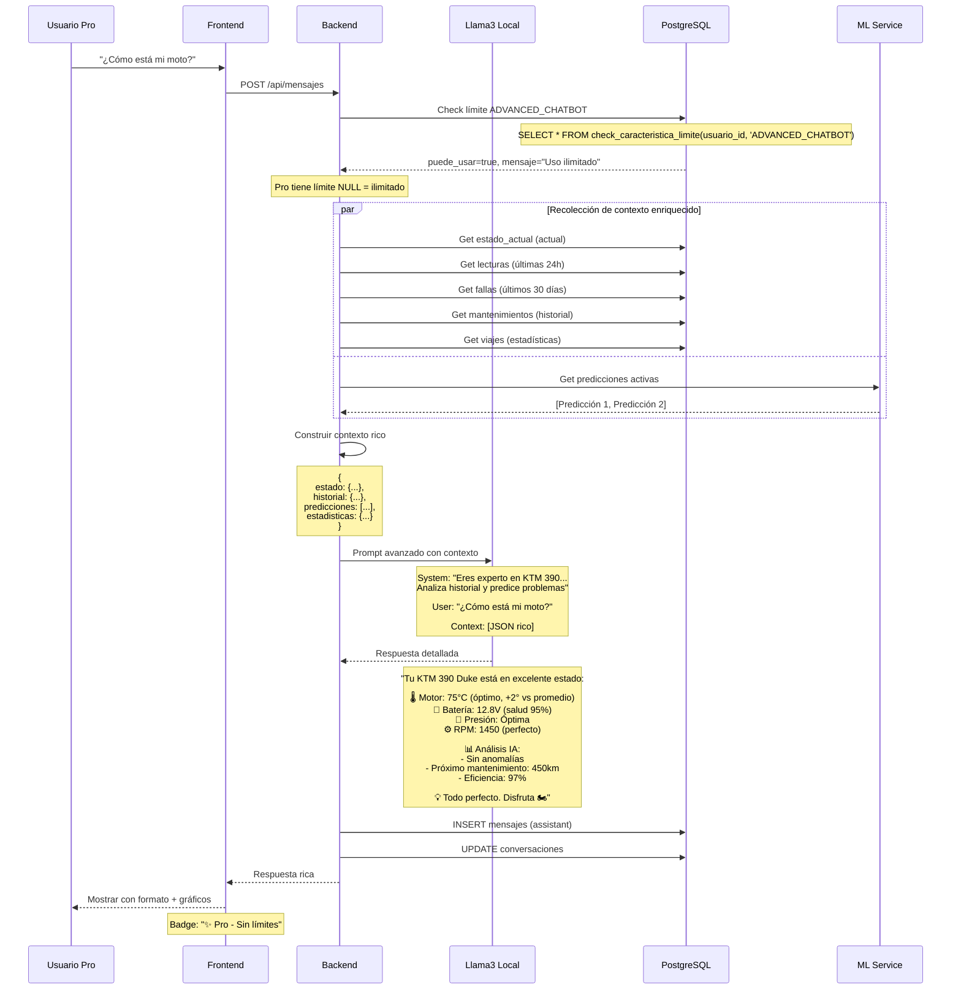
```mermaid
sequenceDiagram
    participant U as Usuario Pro
    participant F as Frontend
    participant API as Backend
    participant LLM as Llama3 Local
    participant DB as PostgreSQL
    participant ML as ML Service

    U->>F: "¿Cómo está mi moto?"
    F->>API: POST /api/mensajes
    
    API->>DB: Check límite ADVANCED_CHATBOT
    Note over DB: SELECT * FROM check_caracteristica_limite(usuario_id, 'ADVANCED_CHATBOT')
    DB-->>API: puede_usar=true, mensaje="Uso ilimitado"
    Note over API: Pro tiene límite NULL = ilimitado
    
    par Recolección de contexto enriquecido
        API->>DB: Get estado_actual (actual)
        API->>DB: Get lecturas (últimas 24h)
        API->>DB: Get fallas (últimos 30 días)
        API->>DB: Get mantenimientos (historial)
        API->>DB: Get viajes (estadísticas)
    and
        API->>ML: Get predicciones activas
        ML-->>API: [Predicción 1, Predicción 2]
    end
    
    API->>API: Construir contexto rico
    Note over API: {<br/>  estado: {...},<br/>  historial: {...},<br/>  predicciones: [...],<br/>  estadisticas: {...}<br/>}
    
    API->>LLM: Prompt avanzado con contexto
    Note over LLM: System: "Eres experto en KTM 390...<br/>Analiza historial y predice problemas"<br/><br/>User: "¿Cómo está mi moto?"<br/><br/>Context: [JSON rico]
    
    LLM-->>API: Respuesta detallada
    Note over LLM: "Tu KTM 390 Duke está en excelente estado:<br/><br/>🌡️ Motor: 75°C (óptimo, +2° vs promedio)<br/>🔋 Batería: 12.8V (salud 95%)<br/>🛞 Presión: Óptima<br/>⚙️ RPM: 1450 (perfecto)<br/><br/>📊 Análisis IA:<br/>- Sin anomalías<br/>- Próximo mantenimiento: 450km<br/>- Eficiencia: 97%<br/><br/>💡 Todo perfecto. Disfruta 🏍️"
    
    API->>DB: INSERT mensajes (assistant)
    API->>DB: UPDATE conversaciones
    
    API-->>F: Respuesta rica
    F-->>U: Mostrar con formato + gráficos
    Note over F: Badge: "✨ Pro - Sin límites"
```

**Características Plan Pro:**

- ✅ **Conversaciones ilimitadas**
- ✅ Contexto enriquecido (historial 24h + fallas + mantenimientos)
- ✅ Predicciones ML integradas
- ✅ Respuestas detalladas con análisis IA

---

## 7. Análisis ML Completo de la Moto

### Flujo: Análisis Completo con IA (v2.3 - Con límites Free)

> **Feature:** `ML_PREDICTIONS` (4 análisis/mes en Free)
>
> **Trigger:** Botón manual **"Analizar moto completa"** en el dashboard
>
> **Propósito:** Análisis exhaustivo de **TODOS los componentes** usando ML para detectar:
>
> - 🔍 Patrones anómalos en sensores
> - ⚠️ Predicciones de fallas inminentes
> - 📊 Evaluación del estado general
> - 🛠️ Recomendaciones de mantenimiento preventivo

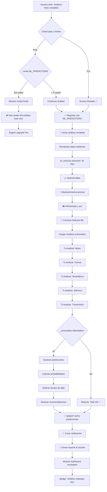
```mermaid
flowchart TD
    A[Usuario click: 'Analizar moto completa'] --> B{Check plan y límites}
    
    B -->|Free| C{Límite ML_PREDICTIONS}
    B -->|Pro| D[Acceso ilimitado ✅]
    
    C -->|4/4 usado| E[Mostrar modal límite]
    C -->|< 4 usado| F[Continuar análisis]
    
    E --> G[❌ 'Has usado 4/4 análisis este mes']
    G --> H[Sugerir upgrade Pro]
    
    F --> I[✅ Registrar uso ML_PREDICTIONS]
    D --> I
    
    I --> J[🔄 Iniciar análisis completo]
    J --> K[Recolectar datos históricos]
    
    K --> L[📊 Lecturas sensores: 30 días]
    L --> M[⚠️ Historial fallas]
    M --> N[🔧 Mantenimientos previos]
    N --> O[🏍️ Kilometraje y uso]
    
    O --> P[🤖 Construir features ML]
    P --> Q[Cargar modelos entrenados]
    
    Q --> R[🔍 Analizar: Motor]
    R --> S[🔍 Analizar: Frenos]
    S --> T[🔍 Analizar: Neumáticos]
    T --> U[🔍 Analizar: Eléctrico]
    U --> V[🔍 Analizar: Transmisión]
    
    V --> W{¿Anomalías detectadas?}
    W -->|Sí| X[Generar predicciones]
    W -->|No| Y[Reporte: Todo OK ✅]
    
    X --> Z[Calcular probabilidades]
    Z --> AA[Estimar tiempo de falla]
    AA --> AB[Generar recomendaciones]
    
    AB --> AC[💾 INSERT INTO predicciones]
    Y --> AC
    
    AC --> AD[📧 Crear notificación]
    AD --> AE[📱 Enviar reporte al usuario]
    
    AE --> AF[Mostrar dashboard resultados]
    AF --> AG[Badge: 'Análisis realizado hoy']
```

**Límites de Análisis ML Completo (v2.3):**

- **Plan Free**:
  - ✅ 4 análisis completos por mes
  - ✅ Reinicio automático el día 1 de cada mes
  - ✅ Notificación cuando se alcanza el límite
  - ⚠️ Análisis adicionales requieren upgrade a Pro
  
- **Plan Pro**:
  - ✅ Análisis completos ilimitados
  - ✅ Sin restricciones de uso

---

### Flujo: Dashboard de Análisis ML (Free vs Pro)

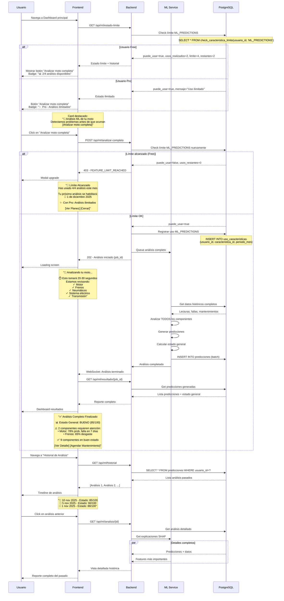
```mermaid
sequenceDiagram
    participant U as Usuario
    participant F as Frontend
    participant API as Backend
    participant ML as ML Service
    participant DB as PostgreSQL

    U->>F: Navega a Dashboard principal
    F->>API: GET /api/ml/estado-limite
    
    API->>DB: Check límite ML_PREDICTIONS
    Note over DB: SELECT * FROM check_caracteristica_limite(usuario_id, 'ML_PREDICTIONS')
    
    alt Usuario Free
        DB-->>API: puede_usar=true, usos_realizados=2, limite=4, restantes=2
        API-->>F: Estado límite + historial
        F-->>U: Mostrar botón "Analizar moto completa"<br/>Badge: "📊 2/4 análisis disponibles"
    else Usuario Pro
        DB-->>API: puede_usar=true, mensaje="Uso ilimitado"
        API-->>F: Estado ilimitado
        F-->>U: Botón "Analizar moto completa"<br/>Badge: "✨ Pro - Análisis ilimitados"
    end
    
    Note over F: Card destacado:<br/>"🤖 Análisis ML de tu moto<br/>Detectamos problemas antes de que ocurran<br/>[Analizar moto completa]"
    
    U->>F: Click en "Analizar moto completa"
    F->>API: POST /api/ml/analizar-completo
    
    API->>DB: Check límite ML_PREDICTIONS nuevamente
    
    alt Límite alcanzado (Free)
        DB-->>API: puede_usar=false, usos_restantes=0
        API-->>F: 403 - FEATURE_LIMIT_REACHED
        F-->>U: Modal upgrade
        Note over F: "🚫 Límite Alcanzado<br/>Has usado 4/4 análisis este mes<br/><br/>Tu próximo análisis se habilitará:<br/>📅 1 de diciembre 2025<br/><br/>✨ Con Pro: Análisis ilimitados<br/><br/>[Ver Planes] [Cerrar]"
    else Límite OK
        DB-->>API: puede_usar=true
        API->>DB: Registrar uso ML_PREDICTIONS
        Note over DB: INSERT INTO uso_caracteristicas<br/>(usuario_id, caracteristica_id, periodo_mes)
        
        API->>ML: Queue análisis completo
        API-->>F: 202 - Análisis iniciado (job_id)
        
        F-->>U: Loading screen
        Note over F: "🔄 Analizando tu moto...<br/><br/>⏱️ Esto tomará 20-30 segundos<br/>Estamos revisando:<br/>✓ Motor<br/>✓ Frenos<br/>✓ Neumáticos<br/>✓ Sistema eléctrico<br/>✓ Transmisión"
        
        ML->>DB: Get datos históricos completos
        DB-->>ML: Lecturas, fallas, mantenimientos
        
        ML->>ML: Analizar TODOS los componentes
        ML->>ML: Generar predicciones
        ML->>ML: Calcular estado general
        
        ML->>DB: INSERT INTO predicciones (batch)
        ML->>API: Análisis completado
        
        API-->>F: WebSocket: Análisis terminado
        F->>API: GET /api/ml/resultado/{job_id}
        
        API->>DB: Get predicciones generadas
        DB-->>API: Lista predicciones + estado general
        
        API-->>F: Reporte completo
        
        F-->>U: Dashboard resultados
        Note over F: "✅ Análisis Completo Finalizado<br/><br/>📊 Estado General: BUENO (85/100)<br/><br/>⚠️ 2 componentes requieren atención:<br/>  • Motor: 78% prob. falla en 7 días<br/>  • Frenos: 65% desgaste<br/><br/>✅ 9 componentes en buen estado<br/><br/>[Ver Detalle] [Agendar Mantenimiento]"
    end
    
    U->>F: Navega a "Historial de Análisis"
    F->>API: GET /api/ml/historial
    
    API->>DB: SELECT * FROM predicciones WHERE usuario_id=?
    DB-->>API: Lista análisis pasados
    
    API-->>F: [Análisis 1, Análisis 2, ...]
    F-->>U: Timeline de análisis
    Note over F: "📅 10 nov 2025 - Estado: 85/100<br/>📅 5 nov 2025 - Estado: 90/100<br/>📅 1 nov 2025 - Estado: 88/100"
    
    U->>F: Click en análisis anterior
    F->>API: GET /api/ml/analisis/{id}
    
    API->>DB: Get análisis detallado
    API->>ML: Get explicaciones SHAP
    
    par Detalles completos
        DB-->>API: Predicciones + datos
        ML-->>API: Features más importantes
    end
    
    API-->>F: Vista detallada histórica
    F-->>U: Reporte completo del pasado
```

**Comparativa de Acceso:**

| Característica | Plan Free | Plan Pro |
|---|---|---|
| Análisis completos/mes | 4 | ∞ Ilimitado |
| Componentes analizados | Todos (11) | Todos (11) |
| Predicciones generadas | Sí | Sí |
| Explicaciones SHAP | Sí | Sí |
| Historial completo | Sí | Sí |
| Estado general (score) | Sí | Sí |
| Contador visible | ✅ "2/4 usado" | ✅ "Ilimitado" |
| Frecuencia recomendada | Mensual | Semanal/diario |

**Diferencia clave Free vs Pro:**

- **Free**: 4 análisis exhaustivos al mes → Usar estratégicamente (antes de viajes largos, cada cambio de aceite)
- **Pro**: Análisis ilimitados → Analizar cuando quieras, múltiples veces por semana

**Endpoints:**

```python
POST   /api/ml/analizar-completo        # Gatilla análisis completo de la moto
GET    /api/ml/estado-limite            # Check límite ML_PREDICTIONS
GET    /api/ml/resultado/{job_id}       # Obtener resultado de análisis
GET    /api/ml/historial                # Listar análisis pasados
GET    /api/ml/analisis/{id}            # Ver análisis específico con detalle
```

**Reglas de Negocio:**

- ✅ Solo activable mediante botón manual (no automático)
- ✅ Analiza **TODOS** los componentes de la moto (11 total)
- ✅ Genera score general de salud (0-100)
- ✅ Crea predicciones solo si probabilidad > 70%
- ✅ Free: máximo 4 análisis por mes
- ✅ Pro: análisis ilimitados
- ✅ Tiempo estimado: 20-30 segundos por análisis
- ✅ WebSocket para notificar cuando análisis termina

---

## 8. Gestión de Viajes

### Flujo: Registro de Viaje

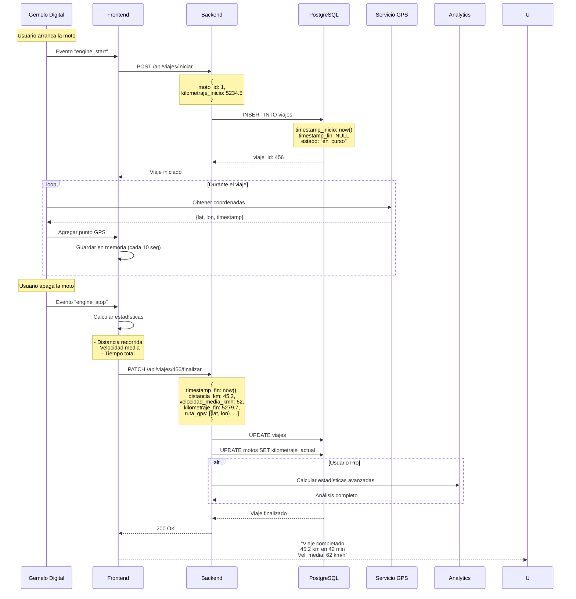
```mermaid
sequenceDiagram
    participant GD as Gemelo Digital
    participant F as Frontend
    participant API as Backend
    participant DB as PostgreSQL
    participant GPS as Servicio GPS

    Note over GD: Usuario arranca la moto
    GD->>F: Evento "engine_start"
    F->>API: POST /api/viajes/iniciar
    Note over API: {<br/>  moto_id: 1,<br/>  kilometraje_inicio: 5234.5<br/>}
    
    API->>DB: INSERT INTO viajes
    Note over DB: timestamp_inicio: now()<br/>timestamp_fin: NULL<br/>estado: "en_curso"
    
    DB-->>API: viaje_id: 456
    API-->>F: Viaje iniciado
    
    loop Durante el viaje
        GD->>GPS: Obtener coordenadas
        GPS-->>GD: {lat, lon, timestamp}
        GD->>F: Agregar punto GPS
        F->>F: Guardar en memoria (cada 10 seg)
    end
    
    Note over GD: Usuario apaga la moto
    GD->>F: Evento "engine_stop"
    F->>F: Calcular estadísticas
    Note over F: - Distancia recorrida<br/>- Velocidad media<br/>- Tiempo total
    
    F->>API: PATCH /api/viajes/456/finalizar
    Note over API: {<br/>  timestamp_fin: now(),<br/>  distancia_km: 45.2,<br/>  velocidad_media_kmh: 62,<br/>  kilometraje_fin: 5279.7,<br/>  ruta_gps: [{lat, lon}, ...]<br/>}
    
    API->>DB: UPDATE viajes
    API->>DB: UPDATE motos SET kilometraje_actual
    
    alt Usuario Pro
        API->>Analytics: Calcular estadísticas avanzadas
        Analytics-->>API: Análisis completo
    end
    
    DB-->>API: Viaje finalizado
    API-->>F: 200 OK
    
    F-->>U: "Viaje completado<br/>45.2 km en 42 min<br/>Vel. media: 62 km/h"
```

---

### Flujo: Ver Historial de Viajes (Pro)

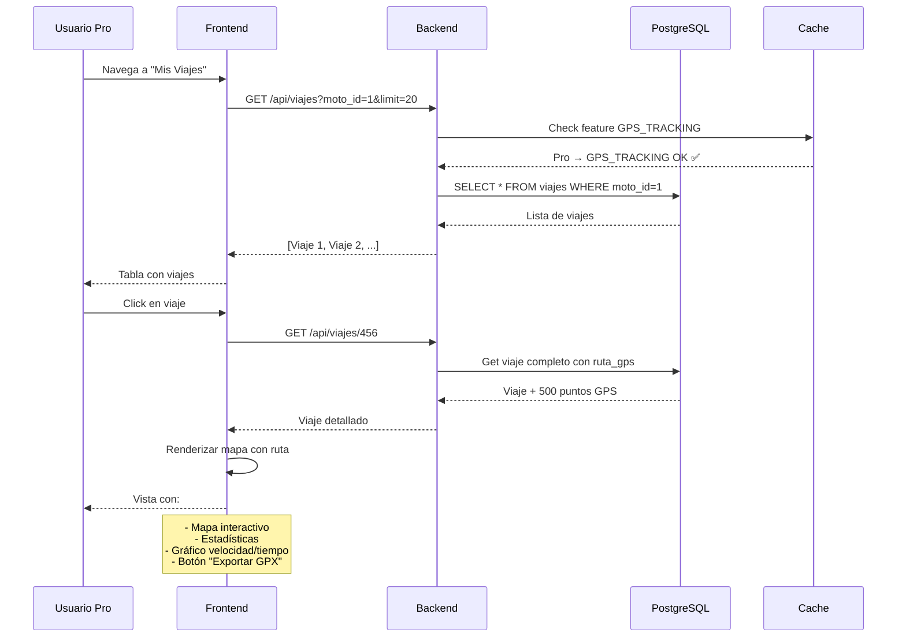
```mermaid
sequenceDiagram
    participant U as Usuario Pro
    participant F as Frontend
    participant API as Backend
    participant DB as PostgreSQL

    U->>F: Navega a "Mis Viajes"
    F->>API: GET /api/viajes?moto_id=1&limit=20
    
    API->>Cache: Check feature GPS_TRACKING
    Cache-->>API: Pro → GPS_TRACKING OK ✅
    
    API->>DB: SELECT * FROM viajes WHERE moto_id=1
    DB-->>API: Lista de viajes
    
    API-->>F: [Viaje 1, Viaje 2, ...]
    F-->>U: Tabla con viajes
    
    U->>F: Click en viaje
    F->>API: GET /api/viajes/456
    
    API->>DB: Get viaje completo con ruta_gps
    DB-->>API: Viaje + 500 puntos GPS
    
    API-->>F: Viaje detallado
    F->>F: Renderizar mapa con ruta
    F-->>U: Vista con:
    Note over F: - Mapa interactivo<br/>- Estadísticas<br/>- Gráfico velocidad/tiempo<br/>- Botón "Exportar GPX"
```

---

## 9. Upgrade Free → Pro

### Flujo: Conversión con Simulación de Pago

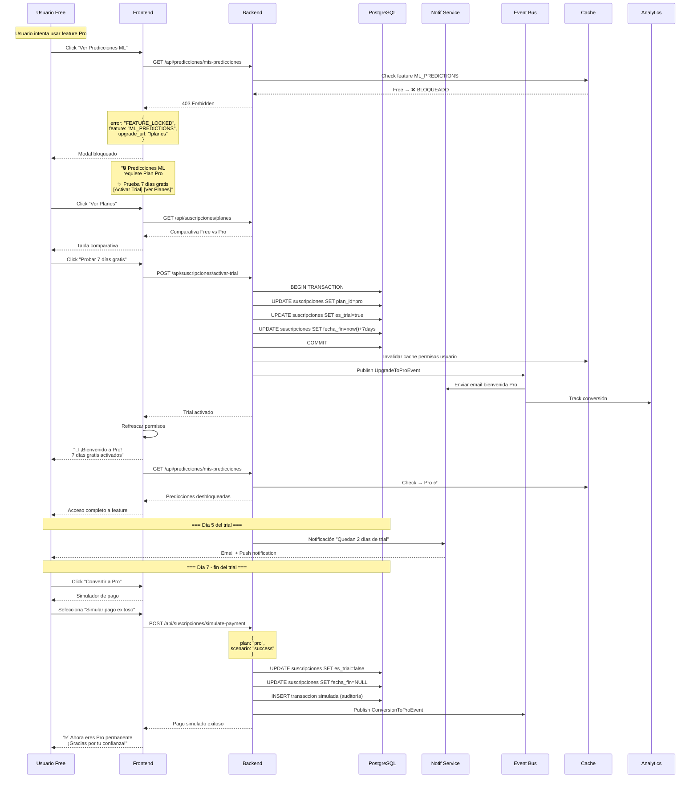
```mermaid
sequenceDiagram
    participant U as Usuario Free
    participant F as Frontend
    participant API as Backend
    participant DB as PostgreSQL
    participant N as Notif Service
    participant Events as Event Bus

    Note over U: Usuario intenta usar feature Pro
    U->>F: Click "Ver Predicciones ML"
    F->>API: GET /api/predicciones/mis-predicciones
    
    API->>Cache: Check feature ML_PREDICTIONS
    Cache-->>API: Free → ❌ BLOQUEADO
    
    API-->>F: 403 Forbidden
    Note over F: {<br/>  error: "FEATURE_LOCKED",<br/>  feature: "ML_PREDICTIONS",<br/>  upgrade_url: "/planes"<br/>}
    
    F-->>U: Modal bloqueado
    Note over F: "🔒 Predicciones ML<br/>requiere Plan Pro<br/><br/>✨ Prueba 7 días gratis<br/>[Activar Trial] [Ver Planes]"
    
    U->>F: Click "Ver Planes"
    F->>API: GET /api/suscripciones/planes
    API-->>F: Comparativa Free vs Pro
    
    F-->>U: Tabla comparativa
    U->>F: Click "Probar 7 días gratis"
    
    F->>API: POST /api/suscripciones/activar-trial
    API->>DB: BEGIN TRANSACTION
    API->>DB: UPDATE suscripciones SET plan_id=pro
    API->>DB: UPDATE suscripciones SET es_trial=true
    API->>DB: UPDATE suscripciones SET fecha_fin=now()+7days
    API->>DB: COMMIT
    
    API->>Cache: Invalidar cache permisos usuario
    API->>Events: Publish UpgradeToProEvent
    
    Events->>N: Enviar email bienvenida Pro
    Events->>Analytics: Track conversión
    
    API-->>F: Trial activado
    F->>F: Refrescar permisos
    F-->>U: "🎉 ¡Bienvenido a Pro!<br/>7 días gratis activados"
    
    F->>API: GET /api/predicciones/mis-predicciones
    API->>Cache: Check → Pro ✅
    API-->>F: Predicciones desbloqueadas
    F-->>U: Acceso completo a feature
    
    Note over U,DB: === Día 5 del trial ===
    
    API->>N: Notificación "Quedan 2 días de trial"
    N-->>U: Email + Push notification
    
    Note over U,DB: === Día 7 - fin del trial ===
    
    U->>F: Click "Convertir a Pro"
    F-->>U: Simulador de pago
    
    U->>F: Selecciona "Simular pago exitoso"
    F->>API: POST /api/suscripciones/simulate-payment
    Note over API: {<br/>  plan: "pro",<br/>  scenario: "success"<br/>}
    
    API->>DB: UPDATE suscripciones SET es_trial=false
    API->>DB: UPDATE suscripciones SET fecha_fin=NULL
    API->>DB: INSERT transaccion simulada (auditoría)
    
    API->>Events: Publish ConversionToProEvent
    API-->>F: Pago simulado exitoso
    
    F-->>U: "✅ Ahora eres Pro permanente<br/>¡Gracias por tu confianza!"
```

---

## 10. Alertas Personalizadas (Pro)

### Flujo: Crear Alerta Custom (v2.3 - Con límites Free)

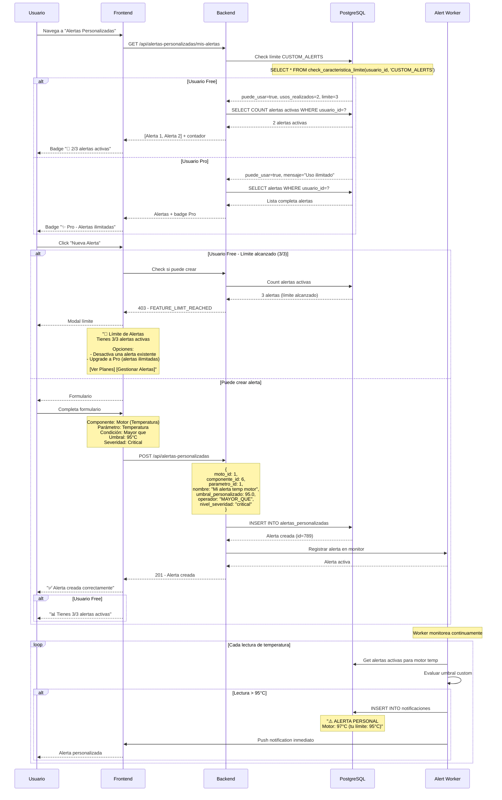
```mermaid
sequenceDiagram
    participant U as Usuario
    participant F as Frontend
    participant API as Backend
    participant DB as PostgreSQL
    participant Worker as Alert Worker

    U->>F: Navega a "Alertas Personalizadas"
    F->>API: GET /api/alertas-personalizadas/mis-alertas
    
    API->>DB: Check límite CUSTOM_ALERTS
    Note over DB: SELECT * FROM check_caracteristica_limite(usuario_id, 'CUSTOM_ALERTS')
    
    alt Usuario Free
        DB-->>API: puede_usar=true, usos_realizados=2, limite=3
        API->>DB: SELECT COUNT alertas activas WHERE usuario_id=?
        DB-->>API: 2 alertas activas
        API-->>F: [Alerta 1, Alerta 2] + contador
        F-->>U: Badge "🔔 2/3 alertas activas"
    else Usuario Pro
        DB-->>API: puede_usar=true, mensaje="Uso ilimitado"
        API->>DB: SELECT alertas WHERE usuario_id=?
        DB-->>API: Lista completa alertas
        API-->>F: Alertas + badge Pro
        F-->>U: Badge "✨ Pro - Alertas ilimitadas"
    end
    
    U->>F: Click "Nueva Alerta"
    
    alt Usuario Free - Límite alcanzado (3/3)
        F->>API: Check si puede crear
        API->>DB: Count alertas activas
        DB-->>API: 3 alertas (límite alcanzado)
        API-->>F: 403 - FEATURE_LIMIT_REACHED
        F-->>U: Modal límite
        Note over F: "🚫 Límite de Alertas<br/>Tienes 3/3 alertas activas<br/><br/>Opciones:<br/>- Desactiva una alerta existente<br/>- Upgrade a Pro (alertas ilimitadas)<br/><br/>[Ver Planes] [Gestionar Alertas]"
    else Puede crear alerta
        F-->>U: Formulario
        
        U->>F: Completa formulario
        Note over F: Componente: Motor (Temperatura)<br/>Parámetro: Temperatura<br/>Condición: Mayor que<br/>Umbral: 95°C<br/>Severidad: Critical
        
        F->>API: POST /api/alertas-personalizadas
        Note over API: {<br/>  moto_id: 1,<br/>  componente_id: 6,<br/>  parametro_id: 1,<br/>  nombre: "Mi alerta temp motor",<br/>  umbral_personalizado: 95.0,<br/>  operador: "MAYOR_QUE",<br/>  nivel_severidad: "critical"<br/>}
        
        API->>DB: INSERT INTO alertas_personalizadas
        DB-->>API: Alerta creada (id=789)
        
        API->>Worker: Registrar alerta en monitor
        Worker-->>API: Alerta activa
        
        API-->>F: 201 - Alerta creada
        F-->>U: "✅ Alerta creada correctamente"
        
        alt Usuario Free
            F-->>U: "📊 Tienes 3/3 alertas activas"
        end
    end
    
    Note over Worker: Worker monitorea continuamente
    
    loop Cada lectura de temperatura
        Worker->>DB: Get alertas activas para motor temp
        Worker->>Worker: Evaluar umbral custom
        
        alt Lectura > 95°C
            Worker->>DB: INSERT INTO notificaciones
            Note over DB: "⚠️ ALERTA PERSONAL<br/>Motor: 97°C (tu límite: 95°C)"
            Worker->>F: Push notification inmediato
            F-->>U: Alerta personalizada
        end
    end
```

**Límites de Alertas Personalizadas (v2.3):**

- **Plan Free**:
  - ✅ Máximo 3 alertas activas simultáneas
  - ⚠️ Debe desactivar una para crear otra
  - ✅ Todas las funcionalidades (umbrales, severidad, notificaciones)
  
- **Plan Pro**:
  - ✅ Alertas ilimitadas
  - ✅ Sin restricciones de cantidad

---

## 11. Sistema de Límites Freemium (v2.3)

### Flujo: Verificación de Límites

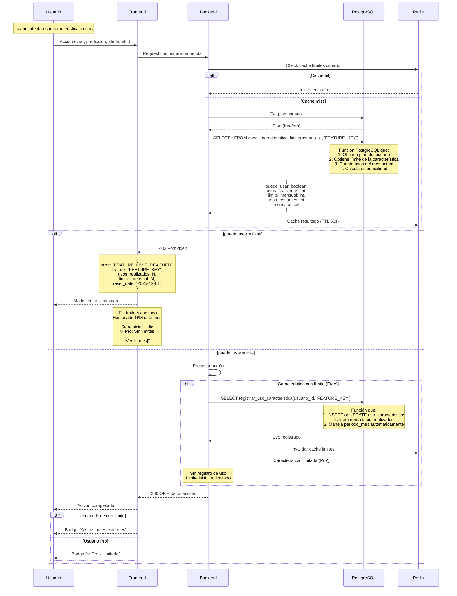
```mermaid
sequenceDiagram
    participant U as Usuario
    participant F as Frontend
    participant API as Backend
    participant DB as PostgreSQL
    participant Cache as Redis

    Note over U: Usuario intenta usar característica limitada
    U->>F: Acción (chat, predicción, alerta, etc.)
    F->>API: Request con feature requerida
    
    API->>Cache: Check cache límites usuario
    
    alt Cache hit
        Cache-->>API: Límites en cache
    else Cache miss
        API->>DB: Get plan usuario
        DB-->>API: Plan (free/pro)
        
        API->>DB: SELECT * FROM check_caracteristica_limite(usuario_id, 'FEATURE_KEY')
        Note over DB: Función PostgreSQL que:<br/>1. Obtiene plan del usuario<br/>2. Obtiene límite de la característica<br/>3. Cuenta usos del mes actual<br/>4. Calcula disponibilidad
        
        DB-->>API: {<br/>  puede_usar: boolean,<br/>  usos_realizados: int,<br/>  limite_mensual: int,<br/>  usos_restantes: int,<br/>  mensaje: text<br/>}
        
        API->>Cache: Cache resultado (TTL 60s)
    end
    
    alt puede_usar = false
        API-->>F: 403 Forbidden
        Note over F: {<br/>  error: "FEATURE_LIMIT_REACHED",<br/>  feature: "FEATURE_KEY",<br/>  usos_realizados: N,<br/>  limite_mensual: M,<br/>  reset_date: "2025-12-01"<br/>}
        
        F-->>U: Modal límite alcanzado
        Note over F: "🚫 Límite Alcanzado<br/>Has usado N/M este mes<br/><br/>Se reinicia: 1 dic<br/>✨ Pro: Sin límites<br/><br/>[Ver Planes]"
    else puede_usar = true
        API->>API: Procesar acción
        
        alt Característica con límite (Free)
            API->>DB: SELECT registrar_uso_caracteristica(usuario_id, 'FEATURE_KEY')
            Note over DB: Función que:<br/>1. INSERT or UPDATE uso_caracteristicas<br/>2. Incrementa usos_realizados<br/>3. Maneja periodo_mes automáticamente
            
            DB-->>API: Uso registrado
            API->>Cache: Invalidar cache límites
        else Característica ilimitada (Pro)
            Note over API: Sin registro de uso<br/>Límite NULL = ilimitado
        end
        
        API-->>F: 200 OK + datos acción
        F-->>U: Acción completada
        
        alt Usuario Free con límite
            F-->>U: Badge "X/Y restantes este mes"
        else Usuario Pro
            F-->>U: Badge "✨ Pro - Ilimitado"
        end
    end
```

---

### Flujo: Reset Automático de Límites

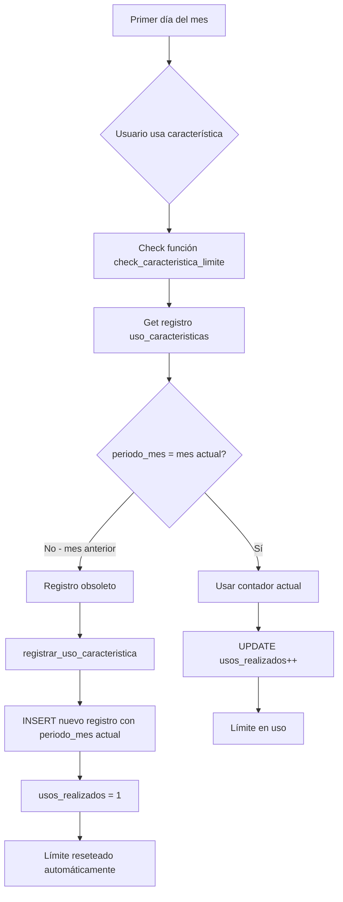
```mermaid
flowchart TD
    A[Primer día del mes] --> B{Usuario usa característica}
    B --> C[Check función check_caracteristica_limite]
    
    C --> D[Get registro uso_caracteristicas]
    
    D --> E{periodo_mes = mes actual?}
    E -->|No - mes anterior| F[Registro obsoleto]
    E -->|Sí| G[Usar contador actual]
    
    F --> H[registrar_uso_caracteristica]
    H --> I[INSERT nuevo registro con periodo_mes actual]
    I --> J[usos_realizados = 1]
    
    G --> K[UPDATE usos_realizados++]
    
    J --> L[Límite reseteado automáticamente]
    K --> M[Límite en uso]
```

**Características del Sistema:**

- ✅ **Reset automático**: Sin cron jobs, se resetea en primer uso del nuevo mes
- ✅ **Sin tracking para Pro**: Usuarios Pro no tienen registros (performance)
- ✅ **Granularidad mensual**: Tracking por periodo_mes (DATE '2025-11-01')
- ✅ **Constraint UNIQUE**: (usuario_id, caracteristica_id, periodo_mes)

---

### Flujo: Dashboard de Uso (Frontend)

```mermaid
sequenceDiagram
    participant U as Usuario Free
    participant F as Frontend
    participant API as Backend
    participant DB as PostgreSQL

    U->>F: Navega a "Mi Plan"
    F->>API: GET /api/usuarios/me/limites
    
    API->>DB: SELECT * FROM v_limites_usuarios WHERE usuario_id=?
    Note over DB: View que muestra:<br/>- Todas las características<br/>- Límites según plan<br/>- Usos del mes actual<br/>- Usos restantes
    
    DB-->>API: Lista de características con uso
    API-->>API: Calcular próximo reset (primer día mes siguiente)
    
    API-->>F: Datos de límites
    F->>F: Renderizar cards por característica
    
    F-->>U: Dashboard de uso
    Note over F: 💬 Chat IA<br/>███░░ 3/5 conversaciones<br/><br/>📊 Predicciones ML<br/>██░░ 2/4 análisis<br/><br/>🔔 Alertas Personalizadas<br/>███ 3/3 alertas activas<br/><br/>📤 Exportar Datos<br/>████████░░ 8/10 exportaciones<br/><br/>🏍️ Motos Adicionales<br/>██ 2/2 motos registradas<br/><br/>Se reinicia: 1 dic 2025
    
    U->>F: Click "Ver Planes"
    F->>API: GET /api/suscripciones/planes
    API-->>F: Comparativa Free vs Pro
    F-->>U: Tabla comparativa con límites destacados
```

---

### Estructura de Datos (v2.3)

**Tabla: caracteristicas**

```sql
id | clave_funcion      | limite_free | limite_pro
---|--------------------|-----------|-----------
1  | BASIC_CHATBOT      | 5         | NULL (∞)
2  | ML_PREDICTIONS     | 4         | NULL (∞)
3  | CUSTOM_ALERTS      | 3         | NULL (∞)
4  | EXPORT_DATA        | 10        | NULL (∞)
5  | MULTI_BIKE         | 2         | NULL (∞)
```

**Tabla: uso_caracteristicas**

```sql
id | usuario_id | caracteristica_id | periodo_mes | usos_realizados | limite_mensual
---|------------|-------------------|-------------|-----------------|---------------
1  | 42         | 1 (BASIC_CHATBOT) | 2025-11-01  | 3               | 5
2  | 42         | 2 (ML_PREDICTIONS)| 2025-11-01  | 2               | 4
3  | 42         | 3 (CUSTOM_ALERTS) | 2025-11-01  | 3               | 3
```

**View: v_limites_usuarios**

- Muestra todas las características con sus límites
- Combina plan del usuario + uso actual
- Calcula usos restantes
- NULL en usos_realizados = característica no usada aún

---

## 12. Procesamiento de Telemetría

### Flujo Técnico: Pipeline de Datos

```mermaid
flowchart LR
    A[Sensor/Gemelo] -->|WebSocket| B[Ingestion Layer]
    B --> C{Validación}
    C -->|Inválido| D[Log Error]
    C -->|Válido| E[Redis Stream]
    
    E --> F[Worker 1: Persist]
    E --> G[Worker 2: Evaluate]
    E --> H[Worker 3: ML]
    
    F --> I[(PostgreSQL<br/>lecturas)]
    G --> J{Evaluar Reglas}
    H --> K[Detección Anomalías]
    
    J -->|Cambio Estado| L[(estado_actual)]
    J -->|Crítico| M[(fallas)]
    
    K -->|Anomalía| N[(predicciones)]
    
    M --> O[Notification Service]
    N --> O
    
    O --> P[Usuario]
```

---

## 13. Evaluación de Reglas de Estado

### Algoritmo de Evaluación

```python
# Pseudo-código del evaluador de reglas

async def evaluar_lectura(lectura: Lectura):
    # 1. Obtener regla aplicable
    regla = await db.get_regla_estado(
        componente_id=lectura.componente_id,
        parametro_id=lectura.parametro_id
    )
    
    if not regla:
        return  # Sin regla configurada
    
    # 2. Evaluar según lógica
    estado_nuevo = None
    
    if regla.logica == "MENOR_QUE":
        if lectura.valor <= regla.limite_critico:
            estado_nuevo = "CRITICO"
        elif lectura.valor <= regla.limite_atencion:
            estado_nuevo = "ATENCION"
        elif lectura.valor <= regla.limite_bueno:
            estado_nuevo = "BUENO"
        else:
            estado_nuevo = "EXCELENTE"
    
    elif regla.logica == "MAYOR_QUE":
        if lectura.valor < regla.limite_critico:
            estado_nuevo = "CRITICO"
        elif lectura.valor < regla.limite_atencion:
            estado_nuevo = "ATENCION"
        elif lectura.valor < regla.limite_bueno:
            estado_nuevo = "BUENO"
        else:
            estado_nuevo = "EXCELENTE"
    
    elif regla.logica == "ENTRE":
        # Para presión de neumáticos, etc.
        if not (regla.limite_critico <= lectura.valor <= regla.limite_bueno):
            estado_nuevo = "CRITICO"
        elif not (regla.limite_atencion <= lectura.valor <= regla.limite_bueno):
            estado_nuevo = "ATENCION"
        else:
            estado_nuevo = "BUENO"
    
    # 3. Obtener estado actual
    estado_actual = await db.get_estado_actual(
        moto_id=lectura.moto_id,
        componente_id=lectura.componente_id
    )
    
    # 4. Si cambió el estado
    if estado_actual.estado != estado_nuevo:
        await db.update_estado_actual(
            id=estado_actual.id,
            estado=estado_nuevo,
            ultimo_valor=lectura.valor
        )
        
        # 5. Si es crítico, crear falla
        if estado_nuevo == "CRITICO":
            await crear_falla_automatica(lectura, regla)
        
        # 6. Notificar cambio
        await websocket.broadcast(
            f"estado:moto:{lectura.moto_id}",
            {
                "componente_id": lectura.componente_id,
                "estado_anterior": estado_actual.estado,
                "estado_nuevo": estado_nuevo,
                "valor": lectura.valor
            }
        )
```

---

## 14. Sistema de Notificaciones

### Flujo: Procesamiento de Notificaciones

```mermaid
flowchart TD
    A[Evento Trigger] --> B[Notification Service]
    B --> C{Get Preferencias Usuario}
    
    C --> D{No Molestar?}
    D -->|Sí| E[Queue para después]
    D -->|No| F{Tipo Notificación}
    
    F -->|Info| G[Prioridad: Baja]
    F -->|Warning| H[Prioridad: Media]
    F -->|Critical| I[Prioridad: Alta]
    
    G --> J{Canales Habilitados}
    H --> J
    I --> J
    
    J --> K[In-App]
    J --> L[Email]
    J --> M[Push]
    J --> N[SMS]
    
    K --> O[INSERT notificaciones]
    L --> P[Queue Email Worker]
    M --> Q[Queue Push Worker]
    N --> R[Queue SMS Worker]
    
    O --> S[WebSocket Broadcast]
    P --> T[SMTP Send]
    Q --> U[FCM/APNS Send]
    R --> V[Twilio Send]
    
    S --> W[Usuario ve en UI]
    T --> X[Email recibido]
    U --> Y[Push en dispositivo]
    V --> Z[SMS recibido]
```

---

## 15. Entrenamiento de Modelos ML

### Flujo: Pipeline de MLOps

```mermaid
flowchart TD
    A[Trigger: Datos suficientes] --> B[ML Training Pipeline]
    B --> C[Extraer Features]
    
    C --> D[Get lecturas últimos 90 días]
    D --> E[Get fallas confirmadas]
    E --> F[Construir dataset]
    
    F --> G{Dataset válido?}
    G -->|No| H[Log error y skip]
    G -->|Sí| I[Split train/test 80/20]
    
    I --> J[Train modelo]
    J --> K[Validar métricas]
    
    K --> L{Accuracy > 0.85?}
    L -->|No| M[Ajustar hiperparámetros]
    M --> J
    
    L -->|Sí| N[INSERT entrenamientos_modelos]
    N --> O[Guardar modelo serializado]
    
    O --> P{Mejor que actual?}
    P -->|No| Q[Mantener modelo anterior]
    P -->|Sí| R[UPDATE en_produccion=true]
    
    R --> S[Desactivar modelo anterior]
    S --> T[Notificar admin]
    
    T --> U[Modelo en producción]
```

---

## 📊 Resumen de Flujos

### Flujos Críticos (MVP v2.3)

1. ✅ **Registro y Login** - Base del sistema
2. ✅ **Registro de Moto** - Onboarding esencial
3. ✅ **Telemetría Tiempo Real** - Core del producto
4. ✅ **Detección de Fallas** - Valor principal
5. ✅ **Mantenimiento** - Gestión completa
6. ✅ **Chatbot Básico/Avanzado** - Diferenciador Free/Pro (5/mes vs ilimitado)
7. ✅ **Upgrade Free → Pro** - Monetización

### Flujos Secundarios (MVP v2.3)

8. ✅ **Análisis ML Completo** - Free: 4/mes, Pro: ilimitado
9. ✅ **Viajes GPS** - Tracking opcional
10. ✅ **Alertas Personalizadas** - Free: 3 max, Pro: ilimitadas
11. ✅ **Sistema de Límites Freemium** - **NUEVO v2.3** - Control de uso

### Flujos Técnicos (Backend)

12. ✅ **Pipeline Telemetría** - Arquitectura de datos
13. ✅ **Evaluador de Reglas** - Lógica de negocio
14. ✅ **Sistema Notificaciones** - Multi-canal
15. ✅ **MLOps** - Entrenamiento continuo

---

## 🆕 Novedades en v2.3

### Sistema de Límites Freemium

El sistema v2.3 introduce un **modelo Freemium mejorado** que permite a usuarios Free probar características premium con límites mensuales:

#### Características con Límites (Free)

| Característica | Free | Pro |
|---|---|---|
| � **Chat IA Básico** | 5 conversaciones/mes | ∞ Ilimitado |
| 📊 **Análisis ML Completo** | 4 análisis/mes | ∞ Ilimitado |
| 🔔 **Alertas Personalizadas** | 3 alertas activas | ∞ Ilimitadas |
| 📤 **Exportar Datos** | 10 exportaciones/mes | ∞ Ilimitado |
| 🏍️ **Motos Adicionales** | 2 motos máximo | ∞ Ilimitadas |

#### Características Ilimitadas (Free)

- ✅ Alertas Básicas (temperatura, batería, etc.)
- ✅ Historial de Servicios
- ✅ Diagnósticos Básicos
- ✅ Localización Básica

#### Ventajas del Nuevo Sistema

1. **Conversión gradual**: Usuarios Free experimentan valor premium antes de pagar
2. **Fricción positiva**: Límites crean puntos de conversión naturales
3. **Reset automático**: Sin gestión manual, se reinicia automáticamente cada mes
4. **Performance óptimo**: Usuarios Pro no tienen tracking de uso
5. **UX transparente**: Contadores visibles, modales informativos

---

## �🔐 Consideraciones de Seguridad

### En Todos los Flujos

1. **Autenticación**: JWT token en header Authorization
2. **Autorización**: Validar usuario_id en cada request
3. **Rate Limiting**: 100 req/min por usuario
4. **Validación Input**: Sanitizar y validar todos los inputs
5. **Logs de Auditoría**: Registrar acciones críticas

### Seguridad de Límites (v2.3)

6. **Validación servidor**: Nunca confiar en cliente para límites
7. **Funciones PostgreSQL**: Lógica centralizada en DB
8. **Cache invalidación**: Limpiar cache al registrar uso
9. **Constraint UNIQUE**: Prevenir duplicados en uso_caracteristicas

---

## 📘 Clarificación: Análisis ML Completo

### ¿Qué es el "Análisis ML Completo"?

El **Análisis ML Completo** (`ML_PREDICTIONS`) es una característica premium que permite al usuario realizar un **análisis exhaustivo de TODA la moto** mediante IA/Machine Learning.

#### Activación

- **Manual**: Usuario hace click en botón **"Analizar moto completa"** en el dashboard
- **NO automático**: No se ejecuta en background ni por lecturas anómalas

#### ¿Qué analiza?

```
🤖 Análisis ML Completo
├── 🔧 Motor (temperatura, RPM, aceite)
├── 🛞 Neumáticos (presión, desgaste)
├── 🔋 Sistema Eléctrico (voltaje, batería)
├── 🛑 Frenos (discos, pastillas)
├── ⛓️ Transmisión (cadena, holgura)
└── ... (11 componentes en total)
```

#### Salida del Análisis

1. **Score General de Salud**: 0-100 puntos
2. **Predicciones de Fallas**: Solo si probabilidad > 70%
   - Componente afectado
   - Tipo de falla probable
   - Tiempo estimado hasta la falla
   - Recomendaciones de acción
3. **Estado de cada componente**: Bueno ✅ / Atención ⚠️ / Crítico 🚨
4. **Explicaciones SHAP**: Qué factores influyeron en las predicciones

#### Límites Free vs Pro

| Aspecto | Plan Free | Plan Pro |
|---|---|---|
| **Análisis/mes** | 4 | ∞ Ilimitados |
| **Componentes analizados** | Todos (11) | Todos (11) |
| **Calidad del análisis** | Completo | Completo |
| **Tiempo de análisis** | 20-30 seg | 20-30 seg |
| **Uso recomendado** | Estratégico<br/>(antes de viaje, post mantenimiento) | Frecuente<br/>(semanal, pre-viaje, cuando quieras) |

#### Ejemplo de Uso Free (4 análisis/mes)

```
Mes: Noviembre 2025

1️⃣ 1 nov - Análisis inicial (Baseline)
2️⃣ 8 nov - Antes de viaje largo a Cusco
3️⃣ 15 nov - Post cambio de aceite (verificar éxito)
4️⃣ 28 nov - Análisis pre-fin de mes

❌ 29 nov - Límite alcanzado → Modal: "Upgrade a Pro"
```

#### Diferencia con Monitoreo Continuo

Es importante distinguir:

| Feature | Descripción | Costo |
|---|---|---|
| **Monitoreo en Tiempo Real** | Lecturas de sensores cada 5 min<br/>Detección automática de alertas<br/>Notificaciones de anomalías | ✅ **Gratis ilimitado**<br/>(Free y Pro) |
| **Análisis ML Completo** | Botón manual "Analizar moto completa"<br/>IA analiza todos los componentes<br/>Genera predicciones de fallas | ⚠️ **4/mes Free**<br/>✨ **∞ Pro** |

**Monitoreo continuo (gratis)**: Sistema siempre vigilando → Alerta si temperatura > 110°C

**Análisis ML (limitado)**: Usuario solicita → IA predice "En 7 días, motor tendrá falla de enfriamiento (78% probabilidad)"

---

**Última actualización**: 10 de noviembre de 2025  
**Versión**: MVP v2.3  
**Cambios principales**: Sistema de límites Freemium con acceso medido a features premium
